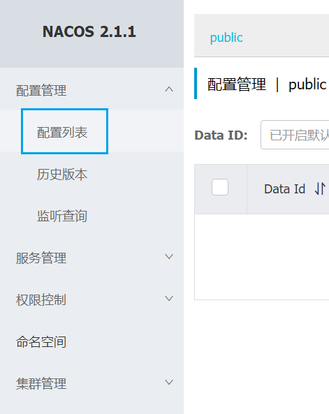

> 参考文章：https://developer.aliyun.com/article/972817

我们使用`Nacos`版本：`nacos/nacos-server:v2.1.1`，`MySQL`版本：`mysql:8.0`。这两个版本实测是可以正常运行的，如果二者版本不兼容，可能会出现一些不可预期的问题。

首先拉取`Nacos`的`docker`镜像：

```bash
docker pull nacos/nacos-server:v2.1.1
```

`Nacos`是需要依赖数据库进行存储的，这里我们使用`MySQL`作为它的持久化数据库。

请确保服务器上已安装`MySQL`，并在`MySQL`中创建一个名为`nacos_config`的数据库。接下来，在该数据库中执行下篇的建表`DDL`语句，创建所需的表。出现下面这些表，表示建表成功：


使用下面命令，创建`nacos`容器，这里要修改`MySQL`的连接信息为对应的信息：

```sh
docker run -d --name nacos \
    -e MODE=standalone \
    -e PREFER_HOST_MODE=hostname \
    -e SPRING_DATASOURCE_PLATFORM=mysql \
    -e MYSQL_SERVICE_HOST=10.40.18.34 \
    -e MYSQL_SERVICE_PORT=3306 \
    -e MYSQL_SERVICE_USER=root \
    -e MYSQL_SERVICE_PASSWORD=123456 \
    -e MYSQL_SERVICE_DB_NAME=nacos_config \
    -p 8848:8848 \
    -p 9848:9848 \
    nacos/nacos-server:v2.1.1
```

这一步是先直接创建一个容器，为了拿到`application.properties`等配置文件，再修改配置文件内容，实现`Nacos`与`MySQL`的关联。

我们在`Linux`服务器建立目录`/srv/docker/nacos/conf/`，执行以下命令，把容器对应文件拷贝到宿主机的目录下：

```shell
mkdir /srv/docker/nacos/conf/
docker cp nacos:/home/nacos/conf/application.properties /srv/docker/nacos/conf/
docker cp nacos:/home/nacos/conf/nacos-logback.xml /srv/docker/nacos/conf/
```

接着我们修改`application.properties`的配置，绿色方框内的是需要修改的地方：


需要注意的事项：

1. `SPRING_DATASOURCE_PLATFORM`这一条，冒号后面原本是有一对双引号的，删掉这对双引号。

2. 删掉`db.url.1`这一条，只保留`db.url.0`，因为我们配置的是单数据库模式。

3. `MySQL`的连接`dsn`中，`connectTimeout`和`socketTimeout`原本设置的是`1000`和`3000`，我们加一个`0`，并且在连接`dsn`后面追加：`&serverTimezone=UTC&allowPublicKeyRetrieval=true`。如果不做这些步骤，`nacos`容器会启动失败：`No DataSource Set`。参考文章：https://blog.csdn.net/zwj1030711290/article/details/124700102。

4. 在文档中，我们可以使用`${}`语法动态获取环境变量，并在参数名之后使用`:`来设置默认值。这意味着，如果环境变量的值为空，则将使用默认值填充，从而允许手动设置环境变量以覆盖该默认值。

我们停止并删除之前的`nacos`容器，重新以数据卷挂载的方式启动容器：

```bash
docker run -d --name nacos \
    -e MODE=cluster \
    -p 8848:8848 \
    -p 9848:9848 \
    -v /srv/docker/nacos/conf:/home/nacos/conf \
    -v /srv/docker/nacos/logs:/home/nacos/logs \
    nacos/nacos-server:v2.1.1
```

> **注意**：最好不要设置`--restart=always`。因为在同一台机器上运行的`Nacos`和`MySQL`，在`Linux`重启时，如果`Nacos`在`MySQL`之前启动，会导致数据源未找到的错误。建议每次开机后手动使用`docker start`启动`Nacos`。

`-e MODE=standalone`参数表示以单机模式运行`Nacos`，适用于开发和测试环境。在此模式下，`Nacos`可以使用内置数据库或配置外部`MySQL`数据库。除`standalone`模式外，还有`cluster`模式，适用于生产环境，支持集群部署。

关于端口`8848`和`9848`：

- `8848`端口用于`Nacos Server`的主服务，包括服务注册、服务发现和配置管理等核心功能的`HTTP API`接口。
- `9848`端口用于`Nacos Server`的`gRPC`通信，主要用于集群节点之间的同步和心跳检测。

`logs`目录存储了`Nacos`服务器的日志文件，包括启动日志、错误日志和其他运行时日志。查看这些日志可以帮助了解`Nacos`服务器的运行状态、错误信息及调试信息，有助于诊断和解决问题。

访问`http://10.40.18.34:8848/nacos`，使用账户名密码登录页面，点击“配置列表”：



我们手动创建一条配置：


查看数据库的`config_info`表，查看到如下的配置信息，说明`Nacos`与`MySQL`连接成功：


之后，宿主机每次重启，都需要重新启动`nacos`容器：

```bash
docker start nacos
```
