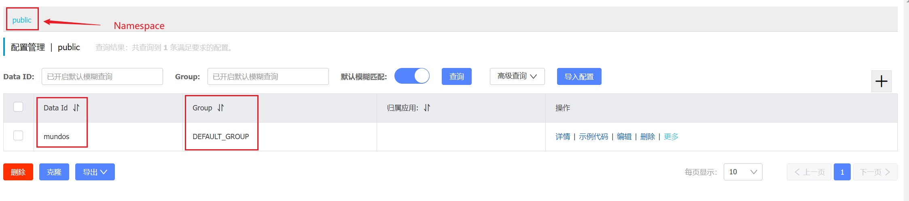

`Nacos`（`Naming and Configuration Service`）是一个开源的服务发现、配置管理和服务治理平台，是`Spring Cloud Alibaba`的一部分。`Nacos`的主要特性有两点：

1. 动态配置管理
1. 服务注册与发现

本文将先介绍动态配置管理的内容，服务注册与发现将在下一章进行讲解。

`Nacos`的一条配置地址由三个要素构成：`Namespace`、`Group`和`DataId`。这三个要素共同定义了一条完整的配置信息。

在同一个`Namespace - Group`下，`DataId`不得重复。

下面详细讲一下这三个概念：

1. `Namespace`：命名空间用于在`Nacos`集群中隔离不同环境或应用的配置信息。通过配置不同的命名空间，可以在同一集群内使用相同的`DataId`和`Group`来管理不同环境下的配置项，从而实现环境间的配置隔离与管理。默认命名空间为`public`。
2. `Group`：分组用于对配置进行细粒度的分类和管理。相同的`DataId`可以在不同的分组中存在，方便根据应用或模块的不同需求进行配置组织。在同一命名空间中，可以使用不同的分组来区分各个微服务的配置，例如将用户服务的配置放在一个分组中，而将订单服务的配置放在另一个分组中。
3. `DataId`：数据标识用于唯一标识配置项。在同一分组内，`DataId`必须是唯一的。通过组合`Namespace`、`Group`和`DataId`，可以精确定位到某个具体的配置项。例如，可以使用一个`DataId`来标识数据库连接配置，使用另一个`DataId`来标识日志级别配置，从而确保配置项的唯一性和可管理性。