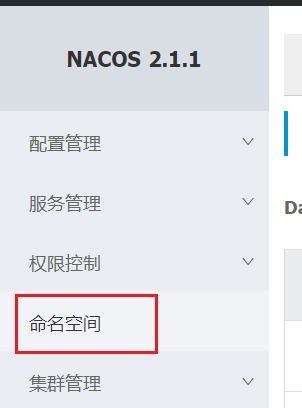
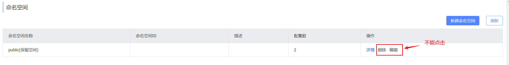
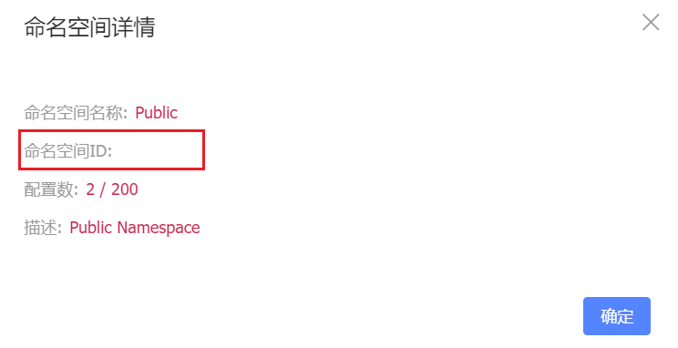
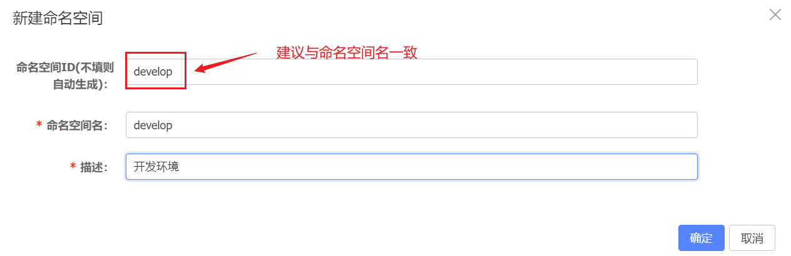
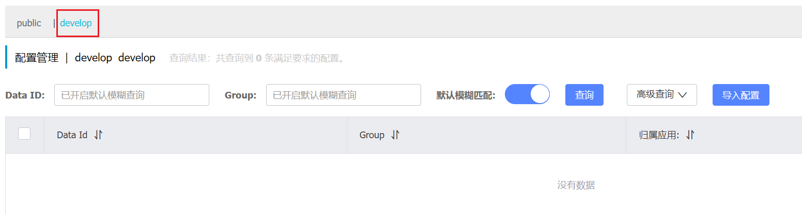
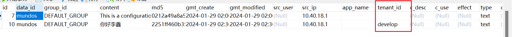
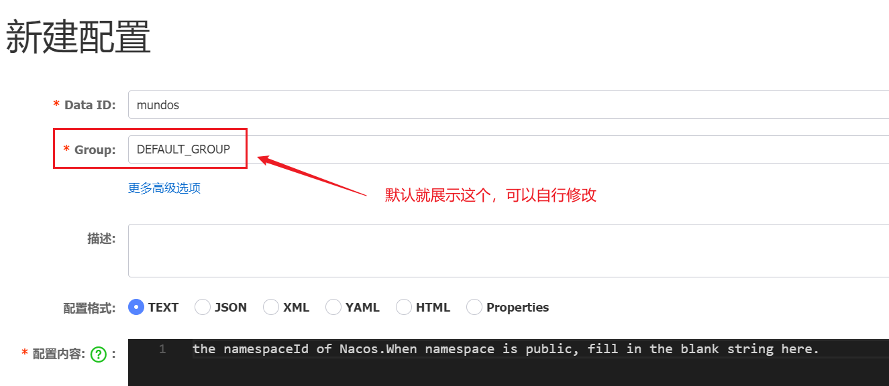
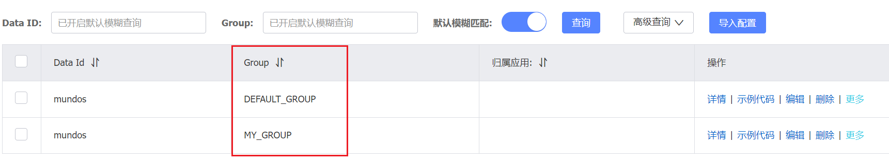
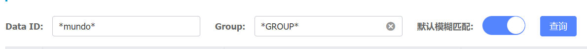

上节我们了解到，一个`Namespace - Group - DataId`的组合，共同构成了`Nacos`中的一条配置。

`Namespace`是`Nacos`中用于隔离不同环境或应用的配置，需要手动创建。要创建`Namespace`，点击以下位置：

我们可以看到只有一条默认的命名空间：`public`，它是不能删除或编辑的：

点击详情，我们看到它的命名空间`ID`是空的：

我们这里新增一条命名空间。建议将命名空间`ID`设置为与命名空间名相同，以便于管理和识别：

返回到配置列表后，就能够看到刚刚创建的命名空间：

在`public`和`develop`环境下各创建一条配置后，查看数据库中的记录，我们会发现两条数据的`tenant_id`字段值不同：

如上所述，`public`命名空间的`ID`为空，而`develop`命名空间的`ID`设置为`develop`，这些信息都体现在`tenant_id`字段中。

在页面查询配置时，系统是根据命名空间`ID`来检索相应的数据，而不是根据命名空间名。

我们再看下新建配置的页面：

在这里，我们需要指定`Data ID`、配置格式和配置内容。`Group`可以使用默认设置，也可以根据需要进行修改。

我们使用`MY_GROUP`作为新建配置的`Group`，`DataId`在不同的`Group`中可以同名：

在这里，我们可以查询具体的配置信息，并且可以使用通配符进行匹配（大小写敏感）：

