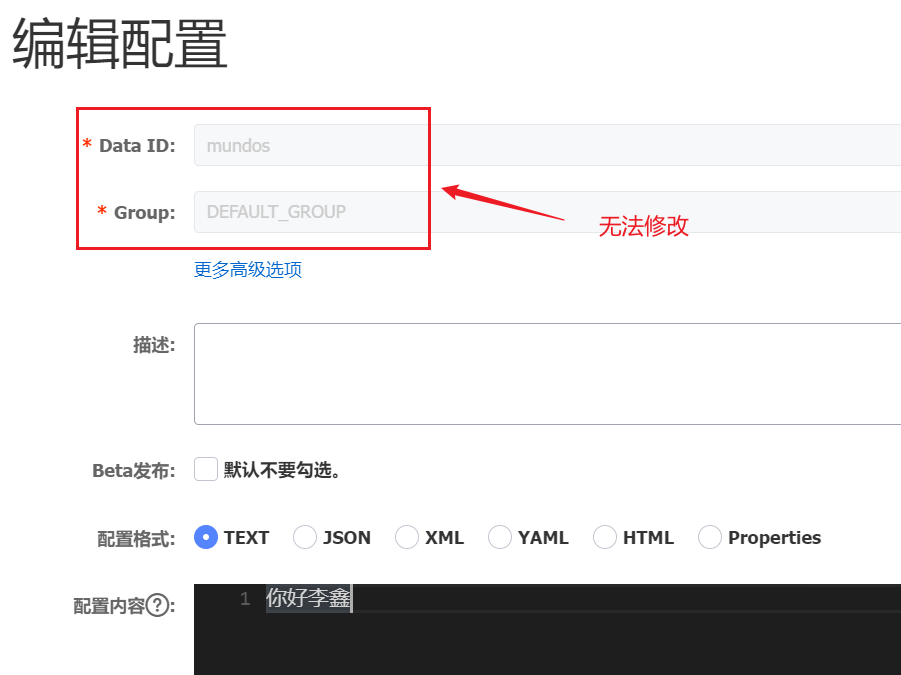
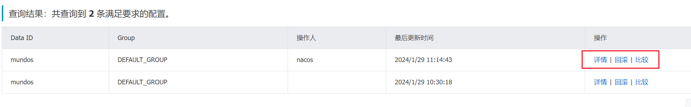
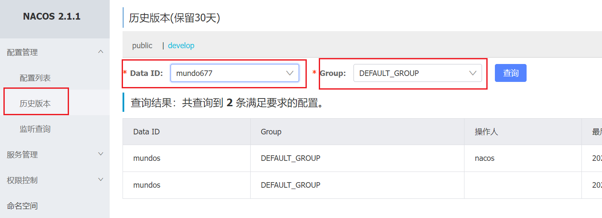

我们创建了一条配置后，点击编辑：

在这里我们发现`DataId`和`Group`是无法修改的，只可以修改配置格式和配置内容：

在对配置格式和配置内容进行修改后，可以查看其历史版本并进行回滚。按照如下步骤操作：

点击上面的按钮后，可以查看这条配置的历史版本，并查看详情、比较或回滚：

也可以点击“历史版本”选项，通过下拉框选择指定的`DataId`与`Group`，点击查询，查看这条配置的历史版本：

