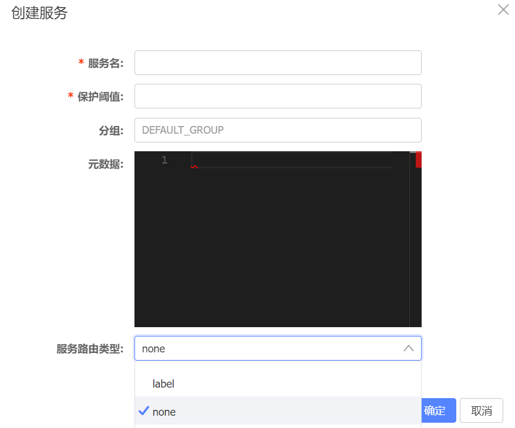

在`Nacos`的主页页面中，关于服务注册与发现，侧边栏包括以下两个目录：


点击“服务列表”和“订阅者列表”目录后，可以看到上方的`Namespace`，这与配置管理中的展示相同，包括默认的`public`和我们在“命名空间”中创建的`develop`：


在页面右上角有一个“创建服务”按钮，我们点击它：


点击“创建服务”按钮后，会出现一个表单，其中包括服务名、保护阈值、元数据三个必填项：



这里讲解一下这三个必填项的概念：

1. 服务名：服务的唯一标识，其他服务或客户端通过该名称来发现和调用服务。确保服务名在系统中唯一。

2. 保护阈值：定义服务保护机制的参数（整数）。当服务实例数低于该阈值时，`Nacos`会触发保护机制，通过限流或降级措施来维护服务稳定性。服务实例数指的是同一服务在负载均衡集群中的实例数量。

3. 元数据：与服务实例相关的信息，包括任意数量的键值对，以`JSON`格式存储。用于记录版本信息、环境信息、扩展属性等。例如：

   ```json
   {
       "env": "prod",
       "version": "v1.0.0"
   }
   ```

至于服务路由类型选项，这里暂时选择`none`。

我们填完所有参数，按下确定后，报了这样一个错误：

```sh
caused: errCode: 500, errMsg: do metadata operation failed ;caused: com.alibaba.nacos.consistency.exception.ConsistencyException: The Raft Group [naming_service_metadata] did not find the Leader node;caused: The Raft Group [naming_service_metadata] did not find the Leader node;
```

要解决这个问题，请按照以下步骤操作：

1. 进入`Nacos`容器：

   ```sh
   docker exec -it nacos /bin/bash
   ```

2. 切换到`/home/nacos/data`目录，并删除`protocol`文件夹：

   ```sh
   cd /home/nacos/data
   rm -rf protocol
   ```

3. 重启`Nacos`容器。

再次创建服务，按照以下信息进行添加创建：


在页面上我们可以看到创建的服务信息，这里注意不要选中“隐藏空服务”：


但是我们发现一个奇怪的现象：刷新几次页面后，服务就无法找到，消失了。合理推测是因为没有任何集群实例注册到该服务上，导致服务在短时间后被自动删除。

创建服务后，`Nacos`的`Docker`日志可能会显示以下警告信息：

```sh
2024-05-21 15:09:56,192 WARN There are no [com.alibaba.nacos.common.trace.event.naming.RegisterServiceTraceEvent] publishers for this event, please register
```

此警告信息在`2.1.1`版本中会出现，但不会产生任何实际影响。在`2.1.2`版本中，此警告信息将被消除。

`Nacos`的订阅者列表页面是一个简单的展示界面，可以根据服务名称和分组名称进行过滤和查询：


对于服务的注册与发现，我们一般是不会直接在页面上进行创建的，而是通过`Go`代码进行操作。