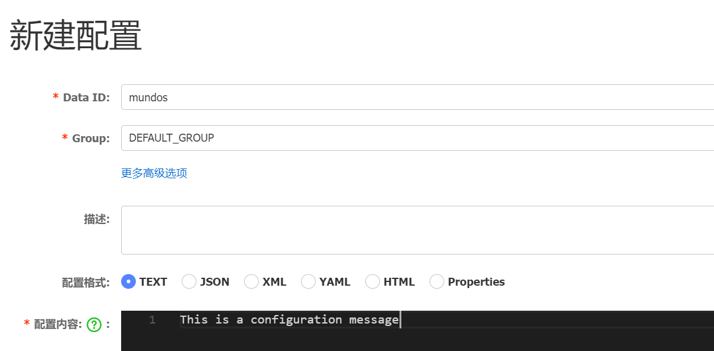

使用以下命令安装`Nacos`库：

```bash
go get github.com/nacos-group/nacos-sdk-go/v2
```

确保`Nacos`的`9848`端口已被正确映射，否则可能会导致以下错误：

```arduino
client not connected, current status:STARTING
```

在代码中引入以下这些必要的模块：

```go
"github.com/nacos-group/nacos-sdk-go/v2/clients"
"github.com/nacos-group/nacos-sdk-go/v2/common/constant"
"github.com/nacos-group/nacos-sdk-go/v2/vo"
```

我们先看新增操作。在页面上，新增操作如下所示，首先我们选一个`Namespace`，点击新增：



需要指定四项内容：`DataId`、`Group`、配置格式、配置内容。

使用`Go`代码操作时，首先需要指定服务器配置：

```go
serverConfigs := []constant.ServerConfig{
	{
		IpAddr: "10.40.18.34",
		Port:   8848,
	},
}
```

或者也可以通过以下方式来指定，效果相同：

```go
serverConfigs := []constant.ServerConfig{
	*constant.NewServerConfig("10.40.18.34", 8848),
}
```

创建客户端配置时，需明确指定要写入的命名空间。此操作要求目标`Namespace`已存在，因为客户端不会自动在`Nacos`中创建命名空间。这里需要注意，代码中`NamespaceId`指的是命名空间的`ID`，而非名称：


```go
clientConfig := constant.ClientConfig{
	NamespaceId:         "develop",
	TimeoutMs:           5000,
	NotLoadCacheAtStart: true,
	Username:            "nacos",
	Password:            "nacos",
}
```

上面的`NamespaceId`配置，有一个特殊情况：如果命名空间为`public`，此项可省略或设置为空字符串，不能填写`public`，否则会导致报错。`TimeoutMs`用于设置`Nacos`服务器的超时时间，单位为毫秒。`NotLoadCacheAtStart`配置决定客户端启动时是否加载缓存，若设置为`true`，客户端将不会在启动时加载缓存数据，而是在需要时再请求并加载。

使用下面函数创建`Nacos`客户端，要看清函数名是`CreateConfigClient`：

```go
client, err := clients.CreateConfigClient(map[string]interface{}{
	"clientConfig":  clientConfig,
	"serverConfigs": serverConfigs,
})
```

也可以通过下面这个函数来创建客户端，要看清函数名是`NewConfigClient`：

```go
client, err := clients.NewConfigClient(
	vo.NacosClientParam{
		ClientConfig:  &clientConfig,  // 需要传递引用对象
		ServerConfigs: serverConfigs,
	},
)
```

发布配置信息（第一个返回值为`bool`类型，表示操作是否成功。此处我们忽略该返回值）：

```go
jsonString := `{"name": "John Doe", "age": 30, "city": "New York"}`
_, err = client.PublishConfig(vo.ConfigParam{
	DataId:  "mundo_conf",
	Group:   "DEFAULT_GROUP",
	Content: jsonString,
	Type:    "json"
})
```

`Type`字段可以指定为`text`、`json`、`yaml`、`xml`等格式，且为可选项。如果不指定该字段，默认为`text`格式。

至此，一个配置已成功创建。如果需要修改配置，仍然调用`PublishConfig`方法，并通过`Group`和`DataId`指定要修改的配置，新的配置信息将覆盖原有内容。

如果是删除配置，就使用`DeleteConfig`方法，指定`DataId`和`Group`，从对应的`Namespace`下删除该配置：

```go
_, err = client.DeleteConfig(vo.ConfigParam{
	DataId: "mundo_conf",
	Group:  "DEFAULT_GROUP",
})
```
