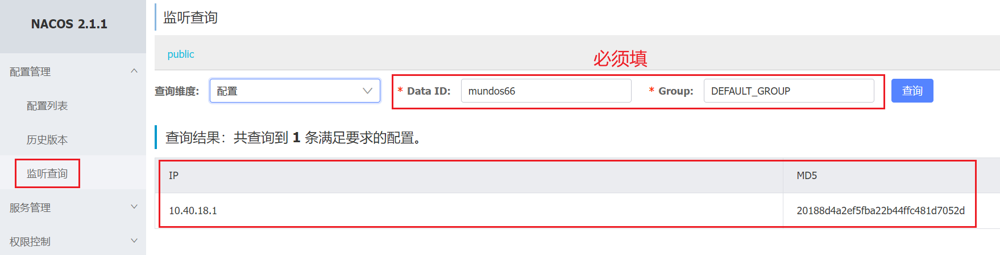

在业务代码中，我们一般要获取并使用`Nacos`中的配置。以下是查询`Nacos`配置的方法，使用到上篇提到的`client`：

```go
content, err := client.GetConfig(vo.ConfigParam{
	DataId: "mundo_conf",
	Group:  "DEFAULT_GROUP",
})
```

这里的`GetConfig`方法的方法签名是这样的：

```go
func (client *ConfigClient) GetConfig(param vo.ConfigParam) (content string, err error)
```

我们可以看到，该方法返回的是一个字符串类型。由于之前发布的配置格式为`json`，因此返回的是`json`字符串。通常情况下，我们需要从这样的`json`格式中提取特定字段的值。

我们使用以前用过的第三方库`gjson`，去完成这件事情，代码如下：

```go
content := `{"name": "John Doe", "age": 30, "city": "New York"}`
name := gjson.Get(content, "name")
fmt.Println(name.String())
```

这样就可以从获取到的`json`字符串中拿到对应字段的值了。

若要在某处监听`Nacos`配置的变化，并在配置发生变化时触发回调函数，可以使用`ListenConfig`方法搭配`OnChange`函数：

```go
err := client.ListenConfig(vo.ConfigParam{
	DataId: "mundo_conf",
	Group:  "DEFAULT_GROUP",
	OnChange: func(namespace, group, dataId, data string) {
		fmt.Println("配置发生变化：", data)
	},
})
```

监听过程是异步非阻塞的，因此需要确保主程序不会退出，例如可以使用`select {}`来进行阻塞。

在启动监听后，可以通过“监听查询”页面，输入`DataId`和`Group`，查询到监听者的`IP`以及`MD5`校验值：



可以使用`CancelListenConfig`方法取消对`Nacos`配置的监听：

```go
err := client.CancelListenConfig(vo.ConfigParam{
	DataId: "mundo_conf",
	Group:  "DEFAULT_GROUP",
})
```

> **注意：**`Nacos`仅支持对指定的一条配置进行监听，而不能对某一`Namespace`下的某一`Group`中的所有`dataId`进行监听。换句话说，`Nacos`不支持一次监听多个配置。此外，`Nacos`也不支持查询某一`Namespace`下的所有`Group`，或查询某一`Group`下的所有`dataId`等操作。