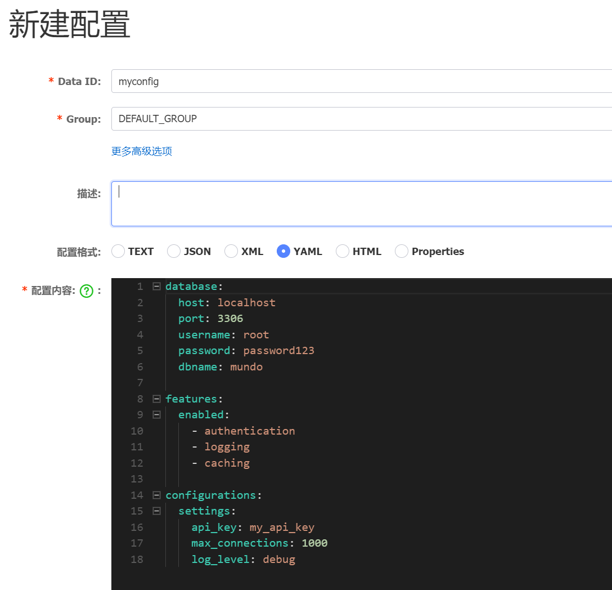

在介绍`Go`语言相关库时，我们提到过`viper`库，它用于读取项目中的配置文件（如`yaml`文件）。这里将讲解`viper`如何读取`Nacos`的配置。`viper`读取`Nacos`配置的过程可以分为下面几步：

1. 在`GoModules`模块下安装`viper`库及`Nacos`的相关第三方库。
1. 使用`Nacos`的第三方库从`Nacos`服务器中获取配置信息。
1. 将获取到的配置解析为`json`或`yaml`等格式，并加载到`viper`中。
1. 使用`viper`提供的`API`（如`GetString`等）读取具体配置，或将配置反序列化为对象。

在上一节中，我们已经安装了`Nacos`的第三方库，这里我们安装一下`viper`库：

```sh
go get github.com/spf13/viper
```

我们首先在`develop`这个`Namespace`下，新建一条配置，如下所示：



该条配置的`dataId`设为`myconfig`，`Group`设为`DEFAULT_GROUP`，配置内容设置为`yaml`格式：

```yaml
database:
  host: localhost
  port: 3306
  username: root
  password: password123
  dbname: mundo

features:
  enabled:
    - authentication
    - logging
    - caching

configurations:
  settings:
    api_key: my_api_key
    max_connections: 1000
    log_level: debug
```

首先，与之前一样，指定`Nacos`配置，获取`Nacos`的`client`对象，并指定要获取的配置信息：

```go
serverConfigs := []constant.ServerConfig{
	{
		IpAddr: "10.40.18.34",
		Port:   8848,
	},
}

clientConfig := constant.ClientConfig{
	NamespaceId:         "develop",
	TimeoutMs:           5000,
	NotLoadCacheAtStart: true,
	Username:            "nacos",
	Password:            "nacos",
}

client, err := clients.NewConfigClient(
	vo.NacosClientParam{
		ClientConfig:  &clientConfig,
		ServerConfigs: serverConfigs,
	},
)

content, _ := client.GetConfig(vo.ConfigParam{
    DataId: "myconfig",
    Group:  "DEFAULT_GROUP",
})
```

接下来，配置`viper`以获取对应的配置信息，并提取所需的数据：

```go
v := viper.New()
v.SetConfigType("yaml")  // yml 也可以
_ = v.ReadConfig(strings.NewReader(content))
host := v.GetString("database.host")
port := v.GetInt("database.port")
fmt.Printf("%s:%d", host, port) // localhost:3306
```

这里的`ReadConfig`方法的方法签名是这样的：

```go
func (v *Viper) ReadConfig(in io.Reader) error
```

它读取的并不是某个具体的配置文件，而是传递进来的配置信息。例如，可以将`yaml`格式的字符串通过`strings.NewReader`函数转换成`io.Reader`类型供`viper`使用。

同样，我们可以把配置文件的内容反序列化到结构体对象上，让项目其他地方可以更方便使用配置，也是使用到`viper`库的这两种方法之一，由于我们上文通过`viper.New()`创建了新的`viper`实例，所以这里我们使用第二个方法：

同样地，我们可以将配置文件的内容反序列化到结构体对象上，以便在项目的其他地方更方便地使用配置。`viper`库提供了两种方法，由于我们在上文中通过`viper.New()`创建了新的`viper`实例，因此这里我们使用第二种方法：

```go
func Unmarshal(rawVal interface{}, opts ...DecoderConfigOption) error
func (v *Viper) Unmarshal(rawVal interface{}, opts ...DecoderConfigOption) error
```

这里的参数`rawVal`是指定的结构体对象的引用。操作完成后，可以通过该结构体对象来访问配置信息。

具体相关内容，可以参照`viper`库一节查看。
