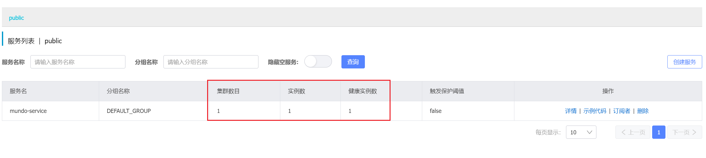
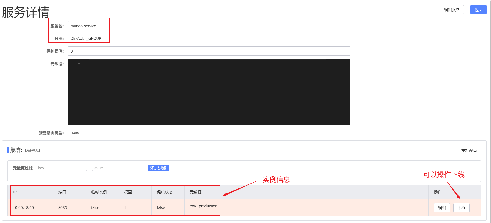
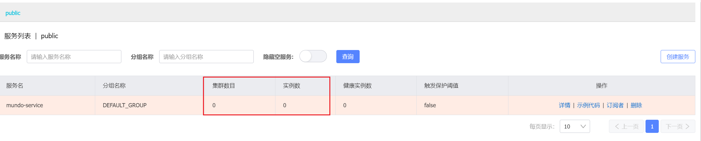

在进行服务注册时，使用的也是下面这个`Nacos`的第三方库：

```
go get github.com/nacos-group/nacos-sdk-go/v2
```

在代码中引入以下这些必要的模块：

```go
"github.com/nacos-group/nacos-sdk-go/v2/clients"
"github.com/nacos-group/nacos-sdk-go/v2/common/constant"
"github.com/nacos-group/nacos-sdk-go/v2/vo"
```

首先还是创建服务器的配置对象：

```go
serverConfigs := []constant.ServerConfig{
	{
		IpAddr:      "10.40.18.34",
		Port:        8848,
	},
}
```

创建客户端配置（`NamespaceId`为`public`时，这里不填或者填空字符串）：

```go
clientConfig := constant.ClientConfig{
	//NamespaceId:         "",
	TimeoutMs:           5000,
	NotLoadCacheAtStart: true,
	Username:            "nacos",
	Password:            "nacos",
}
```

创建`Nacos`客户端时，需要注意函数名是`NewNamingClient`：

```go
client, err := clients.NewNamingClient(
	vo.NacosClientParam{
		ClientConfig:  &clientConfig,
		ServerConfigs: serverConfigs,
	},
)
```

然后，我们可以注册服务实例，使用`vo.RegisterInstanceParam`结构体对象来封装要写入的信息。

结构体`RegisterInstanceParam`的定义如下：

```go
type RegisterInstanceParam struct {
	Ip          string            `param:"ip"`          //required
	Port        uint64            `param:"port"`        //required
	Weight      float64           `param:"weight"`      //required,it must be lager than 0
	Enable      bool              `param:"enabled"`     //required,the instance can be access or not
	Healthy     bool              `param:"healthy"`     //required,the instance is health or not
	Metadata    map[string]string `param:"metadata"`    //optional
	ClusterName string            `param:"clusterName"` //optional
	ServiceName string            `param:"serviceName"` //required
	GroupName   string            `param:"groupName"`   //optional,default:DEFAULT_GROUP
	Ephemeral   bool              `param:"ephemeral"`   //optional
}
```

1. `Ip`和`Port`：应填写当前服务实例的`IP`地址和端口号，`IP`地址通常是动态获取的。
2. `Weight`：实例的权重，用于负载均衡。多个实例时，权重较高的实例被选择的概率更大。
3. `Enable`和`Healthy`：标识实例是否启用及是否健康。如果这两个值均为`false`，实例将不会被客户端调用。
4. `Metadata`：实例的元数据，用于存储一些自定义信息。
5. `ClusterName`：集群名称，默认为`"DEFAULT"`。同一服务可以分配到不同的集群。
6. `ServiceName`：服务名称，唯一标识该实例所属的服务，可自定义名称。
7. `GroupName`：分组名称，默认为`"DEFAULT_GROUP"`。用于对服务进行分组管理。
8. `Ephemeral`：`true`表示临时实例，不会被持久化到`Nacos`存储中。通常设置为`false`。

我们使用`client.RegisterInstance`注册这个服务实例，这个方法的方法签名如下：

```go
func (sc *NamingClient) RegisterInstance(param vo.RegisterInstanceParam) (bool, error)
```

返回两个参数，第一个为是否注册成功，第二个为可能出现的`error`。注册服务实例代码如下：

```go
success, err := client.RegisterInstance(vo.RegisterInstanceParam{
	Ip:          "10.40.18.40",
	Port:        8083,
	ServiceName: "mundo-service",
	Weight:      1.0,
	Enable:      true,
	Metadata:    map[string]string{"env": "production"},
	Healthy:     true,
	Ephemeral:   false,
})
```

在`Nacos`页面查看，可以确认服务实例已经成功注册到平台上：



点击“详情”，可以看到服务信息以及注册的集群实例信息：



想删除服务中的集群实例，使用`client.DeregisterInstance`方法，这个方法的方法签名如下：

```go
func (sc *NamingClient) DeregisterInstance(param vo.DeregisterInstanceParam) (bool, error)
```

其中结构体`DeregisterInstanceParam`的定义如下：

```go
type DeregisterInstanceParam struct {
	Ip          string `param:"ip"`          //required
	Port        uint64 `param:"port"`        //required
	Cluster     string `param:"cluster"`     //optional
	ServiceName string `param:"serviceName"` //required
	GroupName   string `param:"groupName"`   //optional,default:DEFAULT_GROUP
	Ephemeral   bool   `param:"ephemeral"`   //optional
}
```

例如想删除上面新增的实例，使用`DeregisterInstance`方法的代码如下所示：

```go
success, err := client.DeregisterInstance(vo.DeregisterInstanceParam{
	Ip:          "10.40.18.40",
	Port:        8083,
	ServiceName: "mundo-service",
})
```

删除完成后，查看`Nacos`页面，该`service`的集群数和实例数就都为`0`了：



点进详情，页面底部没有集群和实例的具体信息，说明当前`service`的所有集群实例已被删除。在这种情况下，`service`会在短时间后被自动删除。我们也可以通过点击页面上的“删除”按钮直接删除该`service`。

