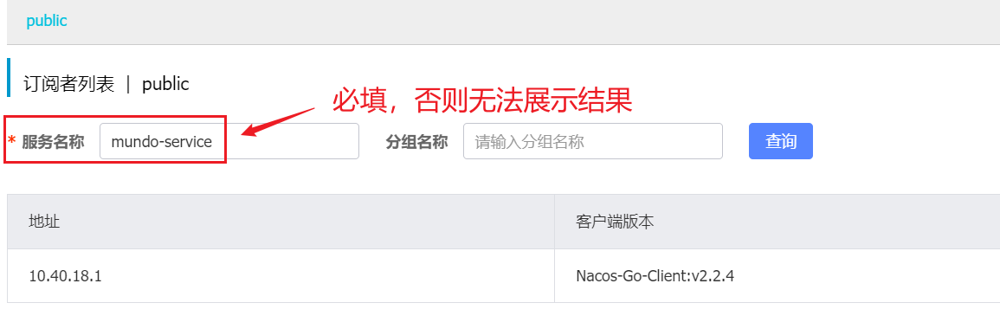

在上一节中，我们讲解了服务的注册相关内容。这一节将讨论服务的订阅与发现。

在`Nacos`的基本概念中，我们提到服务发现是通过服务名称进行定位的。除了服务名称，`Nacos`第三方库还支持使用可选参数如`GroupName`和`Clusters`，以获取对应实例的`IP`地址、端口号等信息。

以下是根据`service`信息获取实例的几个方法，它们的方法签名如下：

```go
SelectAllInstances(param vo.SelectAllInstancesParam) ([]model.Instance, error)
SelectInstances(param vo.SelectInstancesParam) ([]model.Instance, error)
SelectOneHealthyInstance(param vo.SelectOneHealthInstanceParam) (*model.Instance, error)
```

- `SelectAllInstances`：用于获取指定`service`的所有实例。

- `SelectInstances`：用于获取指定`service`的所有健康实例或所有不健康实例。

- `SelectOneHealthyInstance`：用于获取指定`service`的任意一个健康实例。

这些方法的入参结构体定义如下：

```go
type SelectAllInstancesParam struct {
	Clusters    []string `param:"clusters"`    //optional
	ServiceName string   `param:"serviceName"` //required
	GroupName   string   `param:"groupName"`   //optional,default:DEFAULT_GROUP
}

type SelectInstancesParam struct {
	Clusters    []string `param:"clusters"`    //optional
	ServiceName string   `param:"serviceName"` //required
	GroupName   string   `param:"groupName"`   //optional,default:DEFAULT_GROUP
	HealthyOnly bool     `param:"healthyOnly"` //optional,value = true return only healthy instance, value = false return only unHealthy instance
}

type SelectOneHealthInstanceParam struct {
	Clusters    []string `param:"clusters"`    //optional
	ServiceName string   `param:"serviceName"` //required
	GroupName   string   `param:"groupName"`   //optional,default:DEFAULT_GROUP
}
```

返回结构体`model.Instance`的定义如下：

```go
type Instance struct {
	InstanceId                string            `json:"instanceId"`
	Ip                        string            `json:"ip"`
	Port                      uint64            `json:"port"`
	Weight                    float64           `json:"weight"`
	Healthy                   bool              `json:"healthy"`
	Enable                    bool              `json:"enabled"`
	Ephemeral                 bool              `json:"ephemeral"`
	ClusterName               string            `json:"clusterName"`
	ServiceName               string            `json:"serviceName"`
	Metadata                  map[string]string `json:"metadata"`
	InstanceHeartBeatInterval int               `json:"instanceHeartBeatInterval"`
	IpDeleteTimeout           int               `json:"ipDeleteTimeout"`
	InstanceHeartBeatTimeOut  int               `json:"instanceHeartBeatTimeOut"`
}
```

以下是使用`SelectInstances`方法查询所有健康实例，并打印它们的`IP:Port`。这段代码使用了前面定义的`client`对象：

```go
instances, err := client.SelectInstances(vo.SelectInstancesParam{
	ServiceName: "mundo-service",
	HealthyOnly: true,
})

for _, instance := range instances {
	fmt.Printf("%s:%d\n", instance.Ip, instance.Port)
}
```

还有一个方法`Subscribe`，用于订阅服务的变更通知。这意味着当服务的实例发生新增、删除或状态改变等变化时，`Nacos`会通知订阅方，订阅方可以根据指定的逻辑进行处理。该方法的方法签名如下：

```go
func (sc *NamingClient) Subscribe(param *vo.SubscribeParam) error
```

其中，参数`vo.SubscribeParam`的定义如下：

```go
type SubscribeParam struct {
	ServiceName       string                                     `param:"serviceName"` //required
	Clusters          []string                                   `param:"clusters"`    //optional
	GroupName         string                                     `param:"groupName"`   //optional,default:DEFAULT_GROUP
	SubscribeCallback func(services []model.Instance, err error) //required
}
```

`Subscribe`方法的使用示例如下所示：

```go
err = client.Subscribe(&vo.SubscribeParam{
	ServiceName: "mundo-service",
	SubscribeCallback: func(services []model.Instance, err error) {
		fmt.Printf("%s:%d\n", services[0].Ip, services[0].Port)
	},
})
```

> **注意：**`Subscribe`是一个异步非阻塞的方法，因此需要确保主程序不会结束。可以使用`select {}`来实现阻塞以保持程序运行。程序启动时，回调函数会首先执行一次，然后在`service`发生变化时，回调函数会再次被调用。

启动程序后，我们可以在`Nacos`页面上查看到订阅者的具体信息。这里注意必须通过服务名称过滤查询：



我们可以在代码中的适当位置使用`Unsubscribe`方法来取消对服务的订阅。该方法的签名如下：

```go
func (sc *NamingClient) Unsubscribe(param *vo.SubscribeParam) (err error)
```

此代码的使用方式与`Subscribe`方法相同，具体代码示例这里不再展示。

