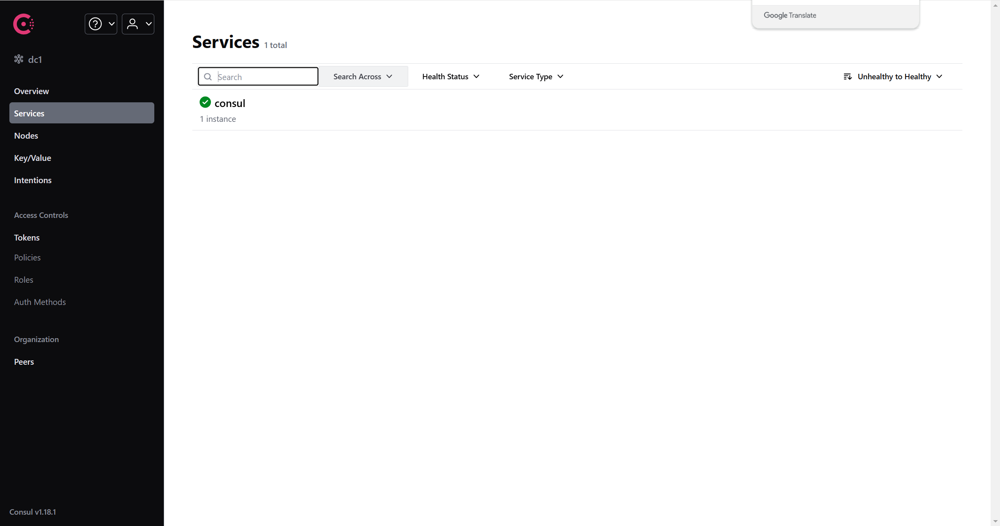

首先拉取`Consul`的`Docker`镜像：

```sh
docker pull hashicorp/consul:1.18.1
```

创建`Consul`的配置文件和数据目录：

```sh
mkdir -p /srv/docker/consul/data
mkdir -p /srv/docker/consul/config
```

在`config`目录下创建一个`config.json`配置文件：

```sh
vim /srv/docker/consul/config/config.json
```

在该文件中写入以下内容：

```json
{
  "datacenter": "dc1",
  "node_name": "consul-node",
  "server": true,
  "bootstrap_expect": 1,
  "data_dir": "/consul/data",
  "log_level": "INFO",
  "client_addr": "0.0.0.0",
  "bind_addr": "0.0.0.0",
  "ui": true
}
```

上面`JSON`中的字段内容含义详解：

- `datacenter`：定义当前节点的数据中心名称，用于隔离服务发现和分布式操作。名称可自定义，如`dc1`、`us-west`等。
- `node_name`：指定节点名称，用于标识当前节点，必须在整个集群中唯一。如果未设置，`Consul`会生成一个随机名称。
- `server`：指示当前节点是否为`Consul`服务器节点。`Consul`服务器节点负责存储集群状态和数据，并参与选举。
- `bootstrap_expect`：定义服务器节点的预期数量，用于初始化集群。例如，设置为`3`时，至少需要`3`个服务器节点完成启动。
- `data_dir`：指定数据存储目录。用于持久化存储`Consul`的数据，如状态信息、快照和事务日志。
- `log_level`：设置日志级别。可选值：`DEBUG`、`INFO`、`WARN`、`ERR`等。
- `client_addr`：定义客户端可访问的监听地址。`0.0.0.0`表示监听所有网络接口地址。可以根据需求改为特定的`IP`。
- `bind_addr`：设置`Consul`节点的绑定地址。单机部署（如开发测试）可使用环回地址或绑定到所有接口。
- `ui`：启用`Consul`的内置`Web UI`。设为`true`后，`Consul`会开放`Web UI`界面，默认在`8500`端口提供访问。

接下来，使用下面命令启动`Consul`容器：

```sh
docker run -d \
    --name=consul \
    --restart=always \
    -p 8500:8500 \
    -p 8600:8600/udp \
    -v /srv/docker/consul/data:/consul/data \
    -v /srv/docker/consul/config:/consul/config \
    hashicorp/consul:1.18.1 \
    agent -config-dir=/consul/config
```

这里开启了`8500`和`8600`端口：`8500`映射`Consul`的`Web UI`和`API`，支持用户通过浏览器访问控制台或调用`API`；`8600`映射`DNS`接口，提供服务发现的`DNS`查询功能。使用`8600/udp`进行端口暴露，是因为默认情况下`DNS`查询使用`UDP`协议，如果不显式声明`UDP`协议，`Docker`默认会只暴露`TCP`，导致应用无法通过`UDP`协议进行`DNS`查询。

`agent -config-dir=/consul/config`这一句指明使用容器内的配置文件启动`Consul`代理。

容器启动完成后，使用下面的地址访问`Consul`的`Web UI`页面：

```http
http://<ip_address>:8500
```

出现如下页面，代表容器启动成功：



上述配置为单节点`Consul`，如需部署多节点集群，可根据需要进行配置。具体步骤将在使用时整理。
