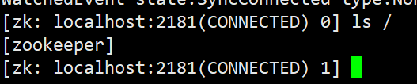

`Kafka`依赖`Zookeeper`运行，所以我们需要先安装`Zookeeper`。这里同样使用`Docker`进行安装。

创建一个网络，指定网络类型为`bridge`（桥接模式）：

```sh
docker network create app-tier --driver bridge
```

拉取`Zookeeper`镜像时，我选择了`3.7.0`版本，这与`Kafka`的`3.0.0`版本能够正常协同工作：

```sh
docker pull zookeeper:3.7.0
```

然后使用下面命令，启动`Zookeeper`的容器：

```sh
docker run -d --name zookeeper \
	--restart always \
    --network app-tier \
    -p 2181:2181 \
    -e ALLOW_ANONYMOUS_LOGIN=yes \
    zookeeper:3.7.0
```

`Zookeeper`的默认暴露端口是`2181`。通过设置`-e ALLOW_ANONYMOUS_LOGIN=yes`，可以允许匿名登录，这意味着任何人都可以连接到`Zookeeper`服务器而无需提供用户名和密码。然而，这项配置不适合在生产环境中使用。

执行命令后，可以使用以下命令，查看`Zookeeper`容器的日志：

```sh
docker logs zookeeper
```

我们使用下面命令，进入到`Zookeeper`容器里：

```sh
docker exec -it zookeeper /bin/bash
```

运行`Zookeeper`的客户端命令：

```sh
zkCli.sh
```

执行后，`Zookeeper`的客户端`shell`会启动，然后执行`ls /`命令：



如果出现如上内容，则表示`Zookeeper`已成功启动。使用`quit`命令可以退出`Zookeeper`客户端，而`exit`命令无效。