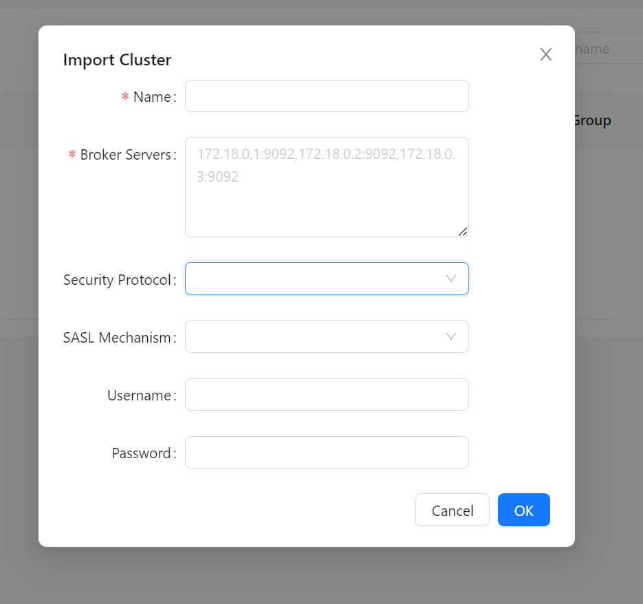
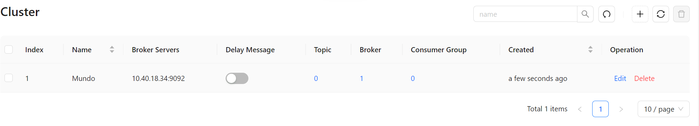

之前在安装`Zookeeper`一节做了一些准备工作，这里安装一下`Kafka`。

拉取`Kafka`的镜像：

```bash
docker pull confluentinc/cp-kafka:7.0.0
```

创建`Kafka`容器：

```bash
docker run -d --name kafka \
	--restart always \
    --network app-tier \
    -p 9092:9092 \
    -e ALLOW_PLAINTEXT_LISTENER=yes \
    -e KAFKA_ZOOKEEPER_CONNECT=zookeeper:2181 \
    -e KAFKA_ADVERTISED_LISTENERS=PLAINTEXT://10.40.18.34:9092 \
    confluentinc/cp-kafka:7.0.0
```

| 参数                                                      | 描述                                             |
| --------------------------------------------------------- | ------------------------------------------------ |
| `ALLOW_PLAINTEXT_LISTENER=yes`                            | 允许`Kafka`使用明文文本传输（不加密）。          |
| `KAFKA_ZOOKEEPER_CONNECT=zookeeper:2181`                  | 设置`Kafka`连接到的`Zookeeper`服务的地址和端口。 |
| `KAFKA_ADVERTISED_LISTENERS=PLAINTEXT://10.40.18.34:9092` | 设置`Kafka`容器对外公开的监听地址和端口。        |

> **注意：** 这里的版本`7.0.0`是`Confluent Platform`的版本号，具体与`Kafka`版本对照表如下所示：
> 
> | Confluent Platform | Apache Kafka | Release Date     | Standard End of Support | Platinum End of Support |
> | ------------------ | ------------ | ---------------- | ----------------------- | ----------------------- |
> | 7.6.x              | 3.6.x        | February 9, 2024 | February 9, 2026        | February 9, 2027        |
> | 7.5.x              | 3.5.x        | August 25, 2023  | August 25, 2025         | August 25, 2026         |
> | 7.4.x              | 3.4.x        | May 3, 2023      | May 3, 2025             | May 3, 2026             |
> | 7.3.x              | 3.3.x        | November 4, 2022 | November 4, 2024        | November 4, 2025        |
> | 7.2.x              | 3.2.x        | July 6, 2022     | July 6, 2024            | July 6, 2025            |
> | 7.1.x              | 3.1.x        | April 5, 2022    | April 5, 2024           | April 5, 2025           |
> | 7.0.x              | 3.0.x        | October 27, 2021 | October 27, 2023        | October 27, 2024        |
> | 6.2.x              | 2.8.x        | June 8, 2021     | June 8, 2023            | June 8, 2024            |
> | 6.1.x              | 2.7.x        | February 9, 2021 | February 9, 2023        | February 9, 2024        |
> 
> 数据来源：https://docs.confluent.io/platform/current/installation/versions-interoperability.html


我们发现镜像版本`7.0.0`对应的`Kafka`版本为`3.0.0`，这个`Kafka`版本可以与`3.7.0`的`Zookeeper`版本良好协同。

启动后，可以使用以下命令，查看`Kafka`容器的日志：

```
docker logs kafka
```

接下来，我们需要安装一个`Kafka`的图形化管理工具，这里我们使用`kafka-map`。

使用下面命令，拉取它的镜像：

```bash
docker pull dushixiang/kafka-map:v1.3.3
```

启动`kafka-map`的容器：

```bash
docker run -d --name kafka-map \
    --network app-tier \
    -p 8001:8080 \
    -v /srv/docker/kafka-map/data:/usr/local/kafka-map/data \
    -e DEFAULT_USERNAME=admin \
    -e DEFAULT_PASSWORD=admin \
    --restart always \
    dushixiang/kafka-map:v1.3.3
```

设置默认账号为`admin`，默认密码为`admin`。挂载目录设置在宿主机的`/home/docker`下。

启动后，可以在浏览器地址栏输入`http://10.40.18.34:8001`进行访问（更改为自己的宿主机地址），它是一个网页工具。

`dushixiang/kafka-map`是一个`SpringBoot`项目，内部使用`Tomcat`服务器，因此默认对外暴露的接口是`8080`。由于`8080`是一个常用端口，建议在映射给宿主机时避免使用此端口。我选择了`8001`作为映射端口。

在新建`kafka`连接的界面有两个必填项，名字随便写，`Broker Servers`可以写一台`Kafka`的地址，也可以写`Kafka`的集群地址：



连接成功后，就可以看到该`Kafka`的信息：



