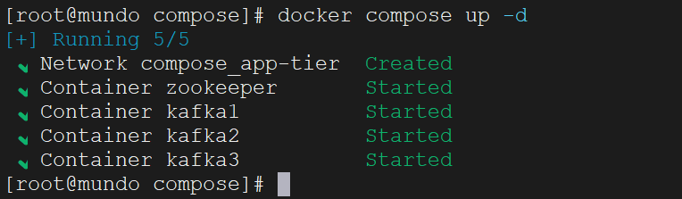
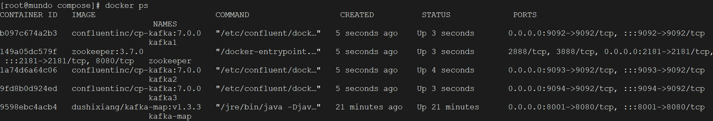
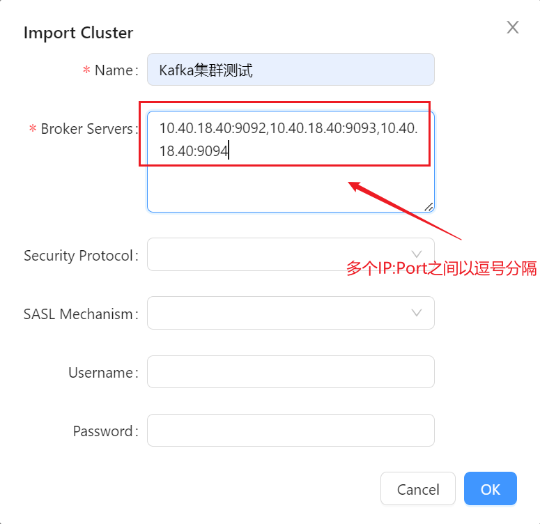
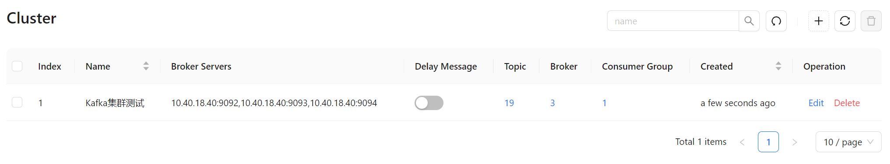

在前述的`Docker`安装步骤中，我们配置了单个`Kafka`实例。然而，在实际开发中，通常会部署一个`Kafka`集群，由多个`broker`共同协作。这种集群架构能够更好地支持应用需求，提供更高的可用性和伸缩性。

`Kafka`的默认端口是`9092`。配置多个`broker`有两种常见方式，以三个`broker`为例：

```bash
IP:9092   IP:9093   IP:9094   # IP相同 Port不同
IP1:9092  IP2:9092  IP3:9092  # IP不同 Port相同
```

可以选择使用不同的`IP`，或者不同的`port`。为了方便配置，我们这里选择了相同`IP`但不同`port`的方式。

之前我们提到过，只要多个`Kafka`实例连接到同一个`Zookeeper`，它们就会构成一个集群。因此，我们选择使用`Docker Compose`来创建这个`Zookeeper`和`Kafka`集群。

首先创建一个`docker-compose.yml`文件，文件内容如下（这个文件需要根据实际配置信息做修改）：

```yaml
version: '3'
networks:
  app-tier:
    driver: bridge
    
services:
  zookeeper:
    image: zookeeper:3.7.0
    container_name: zookeeper
    restart: always
    networks:
      - app-tier
    ports:
      - "2181:2181"
    environment:
      ALLOW_ANONYMOUS_LOGIN: "yes"

  kafka1:
    image: confluentinc/cp-kafka:7.0.0
    container_name: kafka1
    restart: always
    networks:
      - app-tier
    ports:
      - "9092:9092"
    environment:
      KAFKA_ADVERTISED_HOST_NAME: 10.40.18.40
      ALLOW_PLAINTEXT_LISTENER: "yes"
      KAFKA_ZOOKEEPER_CONNECT: "zookeeper:2181"
      KAFKA_ADVERTISED_LISTENERS: PLAINTEXT://10.40.18.40:9092
      KAFKA_LISTENERS: PLAINTEXT://0.0.0.0:9092
      KAFKA_BROKER_ID: 1

  kafka2:
    image: confluentinc/cp-kafka:7.0.0
    container_name: kafka2
    restart: always
    networks:
      - app-tier
    ports:
      - "9093:9093"
    environment:
      KAFKA_ADVERTISED_HOST_NAME: 10.40.18.40
      ALLOW_PLAINTEXT_LISTENER: "yes"
      KAFKA_ZOOKEEPER_CONNECT: "zookeeper:2181"
      KAFKA_ADVERTISED_LISTENERS: PLAINTEXT://10.40.18.40:9093
      KAFKA_LISTENERS: PLAINTEXT://0.0.0.0:9093
      KAFKA_BROKER_ID: 2

  kafka3:
    image: confluentinc/cp-kafka:7.0.0
    container_name: kafka3
    restart: always
    networks:
      - app-tier
    ports:
      - "9094:9094"
    environment:
      KAFKA_ADVERTISED_HOST_NAME: 10.40.18.40
      ALLOW_PLAINTEXT_LISTENER: "yes"
      KAFKA_ZOOKEEPER_CONNECT: zookeeper:2181
      KAFKA_ADVERTISED_LISTENERS: PLAINTEXT://10.40.18.40:9094
      KAFKA_LISTENERS: PLAINTEXT://0.0.0.0:9094
      KAFKA_BROKER_ID: 3
```

切换到这个这个`docker-compose.yml`文件所在目录，使用下面命令启动：

```
docker compose up -d
```



使用`docker ps`命令查看是否启动成功：



启动成功后，我们去`kafka-map`的页面，连接一下这个`kafka`集群。

名称可以随意设置。`Broker Servers`字段应包含集群中多个`Kafka`实例的地址，并以逗号分隔（这里改成实际的地址）：

```sh
10.40.18.40:9092,10.40.18.40:9093,10.40.18.40:9094
```



创建成功后，我们可以在页面上看到这个`Kafka`集群的信息：



