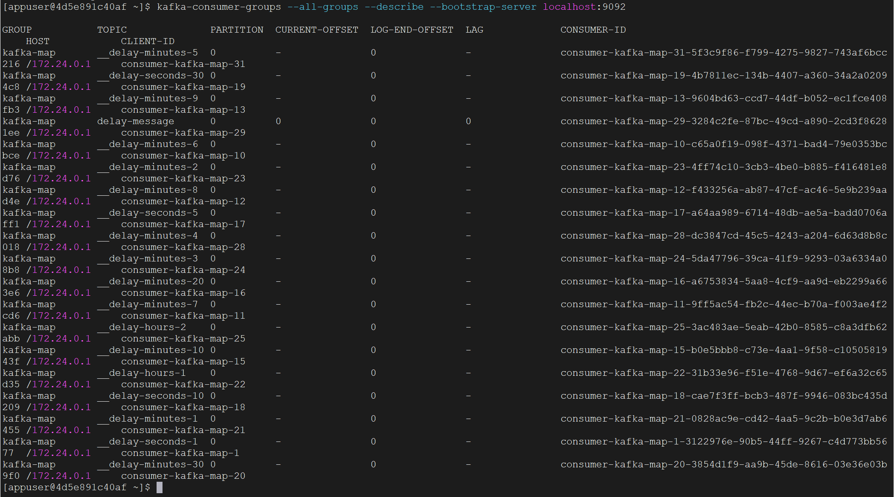

在`Kafka`中，消费者组是非常重要的概念之一。接下来介绍如何使用命令来操作消费者组。

首先，可以使用以下命令查看所有的消费者组：

```bash
kafka-consumer-groups --describe --all-groups --bootstrap-server localhost:9092
```

由于我使用`kafka-map`连接了这个`Kafka`集群，因此显示了如下结果，这些都是`kafka-map`的消费者组：



结果包含了消费者组名称、`topic`名称、分区、消费位移等信息。第一列`group`显示的就是消费者组的名称。

可以使用`--group`选项来过滤某一消费者组，例如我们查询名为`kafka-map`的消费者组：

```bash
kafka-consumer-groups --describe --group kafka-map --bootstrap-server localhost:9092
```

重置消费者组的偏移量，例如，将偏移量重置为最早的可用位置：

```bash
kafka-consumer-groups --group kafka-map --reset-offsets --to-earliest --execute --topic mundo-topic --bootstrap-server localhost:9092
```

`Kafka`不提供直接删除消费者组的命令。消费者组通常由`Kafka`自动管理，当组内没有活跃的消费者时，`Kafka`会自动将其标记为过时并最终删除。

`Kafka`还提供了一些直接消费指定`topic`消息的方法，可以使用`kafka-console-consumer`命令来实现。命令的模板格式如下：

```bash
kafka-console-consumer --topic <topic_name> --bootstrap-server <bootstrap_servers> [其他参数]
```

`<topic_name>`是要消费的`topic`名称。由于我们使用`Docker`创建的`Kafka`，并且在容器内部执行的命令，所以`<bootstrap_servers>`的值通常是`localhost:9092`。

其他一些常见的参数包括：

- `--from-beginning`：从`topic`的开始位置消费消息。如果不指定此参数，将从当前的`offset`开始消费。
- `--group `：指定消费者组的名称。如果不指定，将使用默认的消费者组。
- `--property key=value`：设置额外的消费者配置属性。

例如，要查看`mundo-topic`这个`topic`的消息并将其打印到控制台，可以使用以下命令：

```bash
kafka-console-consumer --topic mundo-topic --bootstrap-server localhost:9092 --from-beginning
```

同时，这条命令会阻塞并持续监听，如果有新消息被发送到`topic`，它会自动消费并输出这些消息。

在`Kafka`中，消息的保留时间由配置参数`log.retention.hours`控制。即使消息已被消费，根据该配置，它们仍会在磁盘上保留一段时间。默认情况下，`Kafka`会保留消息七天（`log.retention.hours=168`），即使消息已被消费，七天后它们才会被自动清理。