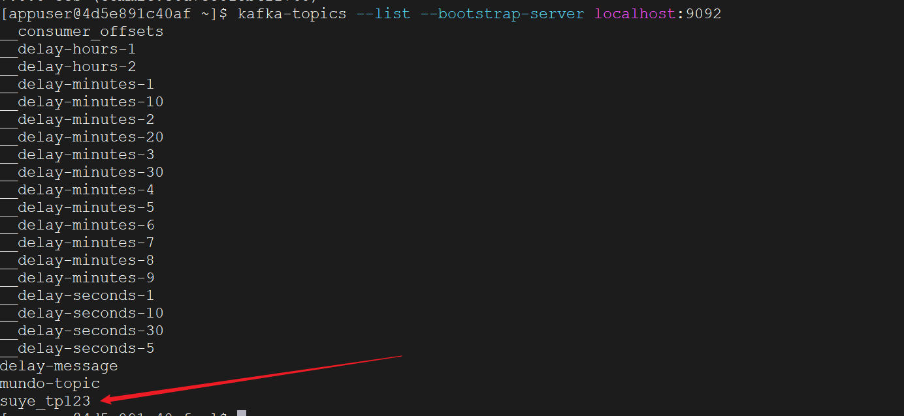
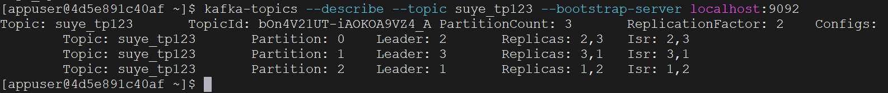

`Go`语言操作`Kafka`有以下两个常用的库，我们这里使用`sarama`库：

```bash
go get github.com/IBM/sarama          # 原 github.com/Shopify/sarama 已不可用
go get github.com/segmentio/kafka-go  # 需要 Go 1.15 以上的版本
```

我们设置`Kafka`集群的地址，将其定义为一个`string`类型的切片：

```go
brokers := []string{"10.40.18.40:9092", "10.40.18.40:9093", "10.40.18.40:9094"}
```

创建`Kafka`配置时，我们根据`Kafka`版本`3.0.0`设置配置版本如下：

```go
config := sarama.NewConfig()
config.Version = sarama.V3_0_0_0 // 设置Kafka版本
```

根据`brokers`和`config`，创建`ClusterAdmin`实例：

```go
admin, _ := sarama.NewClusterAdmin(brokers, config)
```

在程序结束前，需要关闭创建的`admin`实例：

```go
defer admin.Close()
```

设置要创建的`topic`信息如下：

```go
topicDetail := &sarama.TopicDetail{
	NumPartitions:     3,                    // 设置分区数量
	ReplicationFactor: 2,                    // 设置副本数量
	ConfigEntries:     map[string]*string{}, // 设置其他配置项
}
```

调用`CreateTopic`方法以创建`topic`，例如，将其命名为`suye_tp123`：

```go
err = admin.CreateTopic("suye_tp123", topicDetail, false)
```

这里的第三个参数是`validateOnly`。如果设置为`true`，该方法仅验证配置是否正确，而不会在`Kafka`集群中实际创建主题。如果设置为`false`，则在验证配置的同时，如果一切正常，方法会在`Kafka`集群中实际创建主题。

如果尝试创建一个已存在的`topic`（重名），会返回如下的`error`：

```sh
Error creating topic: kafka server: Topic with this name already exists - Topic 'suye_tp123' already exists.
```

我们可以使用之前讲过的查询`topic`的命令来验证这个`topic`是否已创建：

```bash
kafka-topics --list --bootstrap-server localhost:9092
```



或者可以查看这个`topic`的详细信息：

```bash
kafka-topics --describe --topic suye_tp123 --bootstrap-server localhost:9092
```



修改`topic`的信息，例如更新其`configEntries`：

```go
topicName := "suye_tp123"
compact := "compact"
timeMil := "86400000"
configEntries := map[string]*string{
	"cleanup.policy": &compact,
	"retention.ms":   &timeMil, // 设置消息的过期时间（毫秒数）
}

err := admin.AlterConfig(sarama.TopicResource, topicName, configEntries, false)
```

`AlterConfig`方法的方法签名如下所示：

```go
func (ca *clusterAdmin) AlterConfig(resourceType ConfigResourceType, name string, entries map[string]*string, validateOnly bool) error
```

- `resourceType`：表示要更改配置资源的类型，通常为`sarama.TopicResource`或者`sarama.BrokerResource`。
- `name`：表示资源的名称，对于`TopicResource`，就是`Topic`的名称，对于`BrokerResource`，就是`Broker`的`ID`。
- `entries`：一个键值对映射，表示要修改的配置项及其新值。这里注意配置项的值为字符串指针类型。
- `validateOnly`：设置为`true`时，仅验证配置是否有效，不进行实际修改；设置为`false`时，应用配置更改。

> 无法使用代码直接修改`topic`的`NumPartitions`和`ReplicationFactor`。必须先删除`topic`，然后重新创建。

删除指定的`topic`代码如下：

```go
topicName := "suye_tp123"
err = admin.DeleteTopic(topicName)
```

删除后再次用命令查看所有`topic`：

```bash
kafka-topics --list --bootstrap-server localhost:9092
```

发现已经没有`suye_tp123`这一条了。
