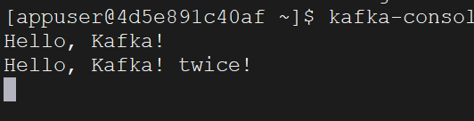

在`Kafka`中，消息的发送和接收是核心内容，也是实现各模块解耦的关键。这一节讲发送消息的相关内容。

在开始将消息发送到`Kafka`之前，首先需要指定`Brokers`：

```go
brokers := []string{"10.40.18.40:9092","10.40.18.40:9093","10.40.18.40:9094"}
```

创建配置信息，并设定相关配置参数：

```go
config := sarama.NewConfig()
config.Version = sarama.V3_0_0_0
config.Producer.RequiredAcks = sarama.WaitForAll
config.Producer.Retry.Max = 5
config.Producer.Retry.Backoff = 100 * time.Millisecond
config.Producer.Return.Successes = true
```

这些参数的含义如下所示：

1. `config.Version`：指定`Kafka`的版本。根据`Kafka`版本`3.0.0`，将其设定为`sarama.V3_0_0_0`。
2. `config.Producer.RequiredAcks`：用于定义生产者在发送消息后所需的确认级别。其主要取值及意义如下：
   - `sarama.NoResponse`：生产者发送消息后不等待任何`Broker`的确认。
   - `sarama.WaitForLocal`：生产者发送消息后，等待`Leader`副本确认消息已成功写入其日志后即视为发送成功。
   - `sarama.WaitForAll`：生产者发送消息后，需等待所有同步副本确认接收消息后，才认为发送成功。
3. `config.Producer.Retry.Max`：设置消息发送失败后的最大重试次数。达到最大重试次数后，生产者将停止重试并返回错误。
4. `config.Producer.Retry.Backoff`：设置两次重试之间的间隔时间，也就是一次失败后等待多久进行下一次重试。
5. `config.Producer.Return.Successes`：控制生产者是否在消息成功发送后返回确认信息。设置为`true`时，`SendMessage`方法会等待`Kafka`确认消息成功写入并返回消息的分区（`partition`）和偏移量（`offset`）。设置为`false`时，`SendMessage`方法会立即返回分区和偏移量，但生产者不会等待`Kafka`的确认，发送过程是异步的，生产者会继续执行后续操作。

接下来，使用指定的`brokers`和`config`，创建一个`producer`：

```go
producer, _ := sarama.NewSyncProducer(brokers, config)
```

构建我们要发送的消息（此处将消息的`Key`设置为`nil`，`Kafka`会根据默认的分区器将消息分配到对应的`Partition`）：

```go
topic := "suye_tp123"
message := "Hello,Kafka!"

msg := &sarama.ProducerMessage{
	Topic: topic,
	Value: sarama.StringEncoder(message),
}
```

在`Kafka`中，除了使用`StringEncoder`，`Value`还可以使用`ByteEncoder`。例如，如果要传递一个结构体对象或`map`，可以先使用`json.Marshal`将其序列化为`JSON`字节数组，然后通过`sarama.ByteEncoder(JsonByte)`进行编码，最后将其赋值给`Value`。

接下来，使用`SendMessage`方法把指定的消息发送出去：

```go
partition, offset, _ := producer.SendMessage(msg)
```

这里的`partition`表示分区，`offset`表示偏移量，我们将它们打印出来：

```go
fmt.Printf("Message sent to partition %d at offset %d\n", partition, offset)
```

我们得到的结果是：`Message sent to partition 0 at offset 0`，这表示消息被发送到了第一个分区，偏移量为`0`。

再发送一个消息后，打印该消息的分区和偏移量，得到的结果是：`Message sent to partition 0 at offset 1`。这表明新的消息也被发送到了相同的分区，偏移量为`1`。

要检查消息是否成功发送到`Kafka`，可以使用以下命令行操作从`Kafka`消费消息并将其打印到控制台：

```bash
kafka-console-consumer --topic suye_tp123 --bootstrap-server localhost:9092 --from-beginning
```

在控制台看到打印内容如下：



在这里，`Kafka`消费者可以持续监听指定的主题，如果有新的消息发送过来，将会持续打印到控制台上。