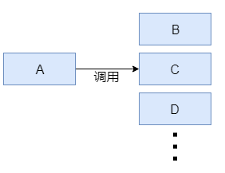
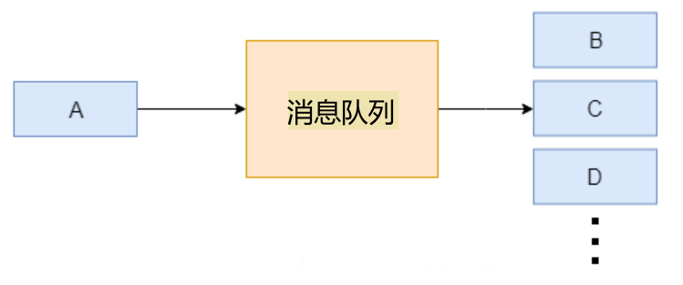
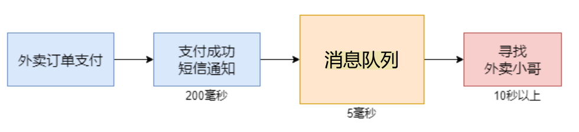
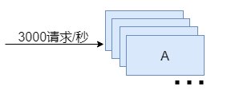
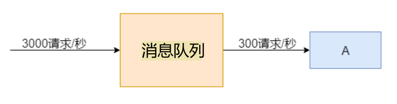

在使用`Kafka`时，通常是先让生产者将消息发送到`Kafka`，然后消费者再从`Kafka`中读取消息进行处理。这种流程的目的是什么？为什么不直接让生产者将数据发送给消费者，而是通过`Kafka`进行中转？

我们知道`Kafka`是一种消息队列，消息队列适用于以下场景：

#### 1. 服务解耦合

通常，消息队列适用于微服务场景中，不同服务之间的数据交互。

例如，生产者`A`生成数据，而消费者`B`、`C`、`D`消费这些数据。虽然我们可以在`A`服务中直接调用`B`、`C`、`D`服务，将数据传递给下游服务，但如果下游服务的数量达到几十甚至几百个，这种做法将导致`A`中调用服务的代码量急剧增加，代码维护也变得极为困难。

因此，我们通过`Kafka`解耦生产者和消费者，使它们之间不直接耦合。这样，生产者和消费者通过`Kafka`进行通信，彼此无需了解对方的存在。生产者可以独立于消费者运行，消费者也可以独立于生产者运行。

#### 2. 异步通信

生产者和消费者之间的通信是异步的。生产者将消息发送到`Kafka`后，可以继续执行其他任务，而消费者则按照自己的速度处理消息。这种异步通信模式有助于提高系统的响应性和吞吐量。

例如，在一个外卖订购场景中，客户点外卖并完成支付后，需要等待寻找外卖小哥的过程。这个寻找过程可能耗时十几秒甚至几十秒，这会导致整个调用链路的响应变得十分缓慢，客户在支付成功后迟迟得不到回应，体验极差。

引入`Kafka`后，支付成功后，将任务发送到消息队列，这样支付端的整个调用链路就可以迅速结束，订单系统也能快速获得响应。寻找外卖小哥的应用则可以以异步的方式从消息队列中接收任务，然后执行耗时的寻找操作。

#### 3. 流量削峰

假设我们有一个应用，平时每秒处理`300`个请求，使用一台服务器就能满足处理需求：

在访问高峰期，访问量可能会是平时的`10`倍，达到每秒`3000`个请求。此时，单台服务器显然无法应对，我们可以考虑使用十台服务器来分散压力。然而，这种高峰期通常每天只持续几分钟，使用十台服务器会导致资源的浪费：

因此，我们可以使用消息队列来进行流量削峰。在高峰期，瞬间涌入的大量请求会被送入消息队列中间件，排队等待处理。这样，我们的应用可以平稳地从消息队列中取出数据进行处理，从而避免瞬时性的压力。同时，`Kafka`的分布式特性允许通过添加更多的`Broker`来水平扩展系统。在系统面临峰值负载时，可以扩展`Kafka`集群，以增加整体的处理能力，从而更好地应对高流量：

除了上述主要使用场景外，还有其他一些原因表明使用`Kafka`的必要性：

1. 消息持久化：`Kafka`允许将消息持久化保存，即使消费者在一段时间内离线，它仍然可以获取到离线期间发送的消息。消息首先被写入`Kafka`的`Topic`，然后持久化保存在`Broker`中，消费者可以按需拉取这些消息。

2. 容错性：`Kafka`是分布式的，具有多个`Broker`，每个`Broker`保存了`Topic`的一个或多个分区的副本。即使某个`Broker`出现故障，其他`Broker`上的副本仍然保留数据，从而确保消息的可用性和容错性。
