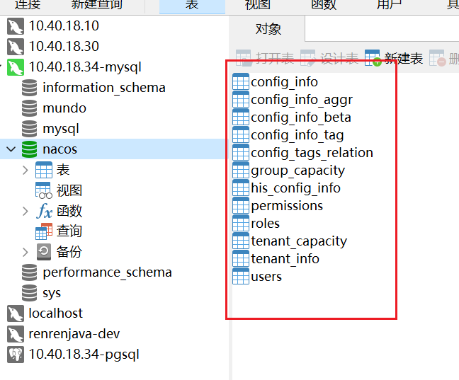
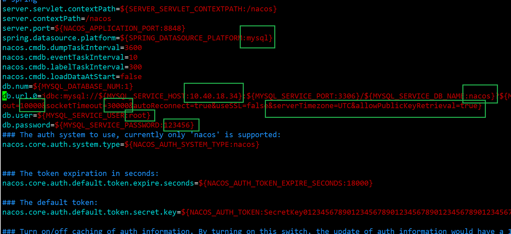
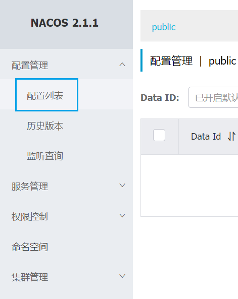
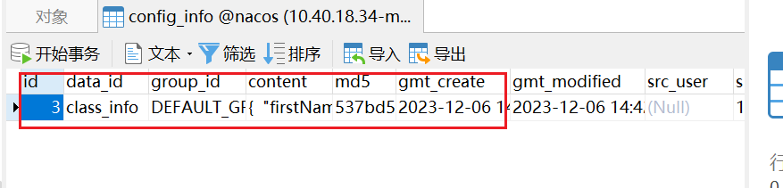

参考文章：

[Docker+Mysql部署Nacos2.1.0-阿里云开发者社区 (aliyun.com)](https://developer.aliyun.com/article/972817)

https://blog.csdn.net/zwj1030711290/article/details/124700102


nacos版本：nacos/nacos-server:v2.1.1

MySQL版本：mysql:8.0

这两个版本实测是可以正常运行的，如果二者版本不一致，可能会出现一些问题。

首先要确保安装了docker

拉取nacos的docker镜像：

```bash
docker pull nacos/nacos-server:v2.1.1
```

nacos是需要依赖数据库进行存储的，这里我们使用MySQL作为它的持久化数据库。

首先确保你的服务器上已经安装了mysql，我这里安装了mysql8.0。

在MySQL中建了一个数据库，取名为nacos，然后要在这个数据库里建表。

执行建表语句，见同级目录下：2.nacos建表语句。



出现这些表，表示建表成功。

使用以下命令，创建nacos容器，这里要把配置改成自己的：

```bash
docker run -d \
-e MODE=standalone \
-e PREFER_HOST_MODE=hostname \
-e SPRING_DATASOURCE_PLATFORM=mysql \
-e MYSQL_SERVICE_HOST=10.40.18.34 \
-e MYSQL_SERVICE_PORT=3306 \
-e MYSQL_SERVICE_USER=root \
-e MYSQL_SERVICE_PASSWORD=123456 \
-e MYSQL_SERVICE_DB_NAME=nacos \
-p 8848:8848 \
--name nacos \
nacos/nacos-server:v2.1.1
```

| 参数                                | 描述                                     |
| ----------------------------------- | ---------------------------------------- |
| docker run -d                       | 以后台模式运行容器                       |
| -e MODE=standalone                  | 指定 Nacos 的运行模式为单节点            |
| -e PREFER_HOST_MODE=hostname        | 设置首选主机模式为主机名                 |
| -e SPRING_DATASOURCE_PLATFORM=mysql | 指定 Spring 数据源的平台为 MySQL         |
| -e MYSQL_SERVICE_HOST=10.40.18.34   | MySQL 服务的主机地址                     |
| -e MYSQL_SERVICE_PORT=3306          | MySQL 服务的端口号                       |
| -e MYSQL_SERVICE_USER=nacos         | 连接 MySQL 的用户名                      |
| -e MYSQL_SERVICE_PASSWORD=123456    | 连接 MySQL 的密码                        |
| -e MYSQL_SERVICE_DB_NAME=nacos      | 连接的 MySQL 数据库名称                  |
| -p 8848:8848                        | 将容器的 8848 端口映射到主机的 8848 端口 |
| --name nacos                        | 为容器指定的名称                         |
| --restart=always                    | 设置容器开机自动重启                     |
| nacos/nacos-server                  | 要运行的镜像及版本                       |

这一步是先直接创建一个容器，为了拿到application.properties等配置文件。

首先我们在etc目录下创建一个目录 nacos，在nacos目录下创建目录conf

执行以下命令：

```shell
docker cp nacos:/home/nacos/conf/application.properties /home/docker/nacos/conf/
docker cp nacos:/home/nacos/conf/nacos-logback.xml /home/docker/nacos/conf/
```

这里，我们把运行中的容器nacos中的对应文件拷贝到宿主机的 /etc/nacos/config/ 目录下。

然后我们修改application.properties的配置。



绿色方框内的是修改的地方。

注意事项：

1. SPRING_DATASOURCE_PLATFORM 这一条，冒号后面原本是有一对双引号的，删掉这对双引号
2. 删掉db.url.1这一条，因为我们这是单数据库模式。
3. connectTimeout 和 socketTimeout 原本设置的是1000和3000，我们加一个0，并且在后面加上：&serverTimezone=UTC&allowPublicKeyRetrieval=true。如果不做这些步骤，nacos容器会启动失败：No DataSource Set。解决文档：https://blog.csdn.net/zwj1030711290/article/details/124700102

这里设置的是默认的值，也就是这个环境变量值为空的时候，用默认值填充，以便我们可以手动添加环境变量覆盖这个默认值。

然后我们**停止并删除**之前的nacos容器，重新以数据卷挂载的方式启动容器。

```bash
docker run -d \
-e MODE=standalone \
-p 8848:8848 \
-v /home/docker/nacos/conf:/home/nacos/conf \
-v /home/docker/nacos/logs:/home/nacos/logs \
-v /home/docker/nacos/data:/home/nacos/data \
--name nacos \
nacos/nacos-server:v2.1.1
```

注意：这里最好不要设置 --restart=always ，因为我这里的nacos和mysql是在同一台机器上，Linux重启时，如果nacos在MySQL之前启动，就会报找不到数据源的错误。

我们可以每次开机都自启动一次nacos。

然后访问 10.40.18.34:8848/nacos 登录页面



创建一条配置


查看数据库的 config_info 表



已有此条消息，配置nacos与mysql成功！

之后，宿主机每次重启，都需要重新启动nacos容器

```bash
docker start nacos
```

