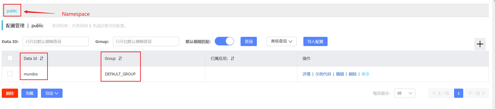

Nacos（Naming and Configuration Service）是一个开源的服务发现、配置管理、服务治理平台，是SpringCloud Alibaba的一部分。

Nacos的主要两大特性就是：

1. 服务注册与发现：Nacos允许应用动态注册、注销和发现服务实例。这使得服务能够在运行时加入或退出系统，实现弹性的微服务架构。
2. 动态配置管理：Nacos提供了统一的配置管理功能，允许将配置信息集中存储，并实时推送到系统中的应用。这使得配置的修改可以即时生效，而且可以基于不同的环境或应用进行灵活的配置。

我们先讲一下动态配置管理的内容。

Nacos一条配置的地址就是：`Namespace - Group - DataId`，这三个要素构成了一条配置信息：

在同一个`Namespace - Group`下，DataId不得重复。

下面详细讲一下这三个概念：

1. Namespace：命名空间是用来隔离不同环境或不同应用的配置信息的。它允许在同一个Nacos集群中使用相同的DataId和Group来标识不同的配置，通过设置不同的命名空间来区分它们。如果开发、测试和生产环境中使用相同的配置项但需要不同的值，可以使用命名空间来实现配置的分离和管理。它的默认值为public。
2. Group：分组是为了更细粒度地对配置进行分类和管理。一个DataId可以在不同的分组中存在，这样你可以根据应用或模块的不同将配置进行组织。如果在一个命名空间中有多个微服务，可以使用不同的分组将它们的配置信息进行区分，比如将用户服务的配置放在一个分组，订单服务的配置放在另一个分组。
3. DataId：数据标识用于唯一标识一个配置项。在同一个分组下，DataId是唯一的。通过指定命名空间、分组和DataId，可以定位到具体的配置项。如果有一个微服务的配置，可以使用DataId来标识不同的配置项，比如一个DataId表示数据库连接配置，另一个DataId表示日志级别配置。