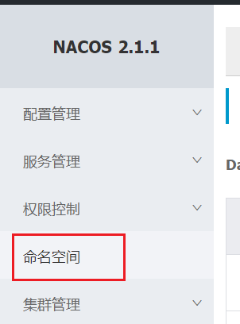
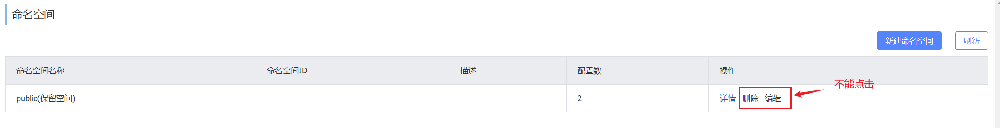
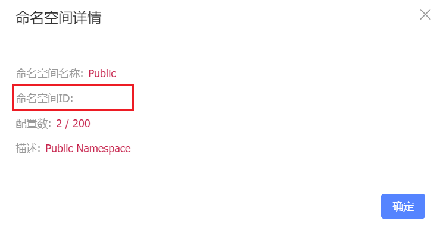
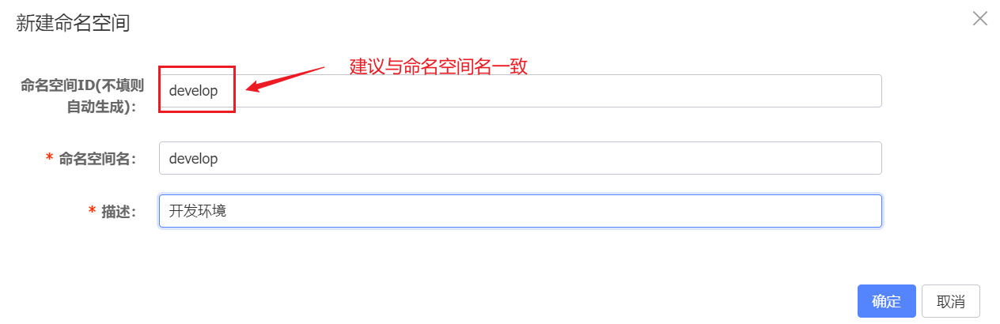
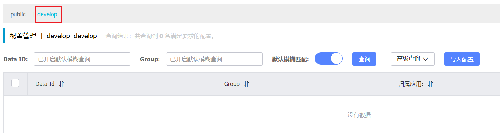
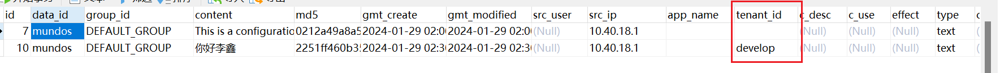
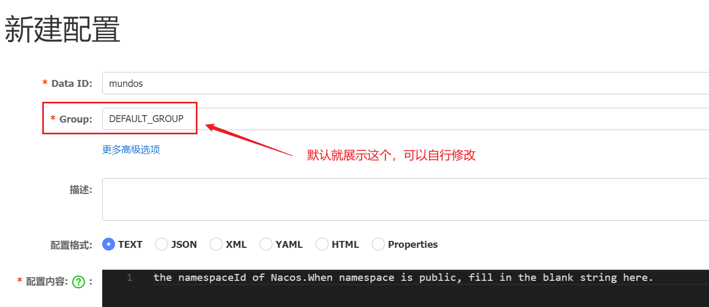
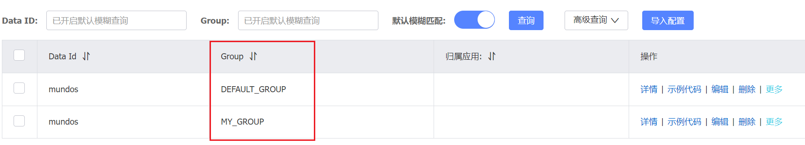

上节我们知道，一个`Namespace - Group - DataId`构成了Nacos的一条配置。

Namespace在Nacos中是需要手动创建的，点击这里：

我们可以看到只有一条默认的命名空间：public，它是不能删除或编辑的。

点击详情，我们看到它的命名空间ID是空的。

我们这里新增一条命名空间

回到配置列表，我们就能看到这样一个命名空间了

我们在public和develop环境下都创建一条配置，看它们在库里的数据有哪点不同：

我们看到这两条数据了，它们的这个字段的值不同：

上面我们看到过，public命名空间ID是空的，develop命名空间ID我们设置为了develop，都体现在这个字段里了。

在页面查询时，是按照命名空间ID来查询对应数据，而不是命名空间名。

我们再看下新建配置的页面：

这里我们需要指定Data ID、配置格式、配置内容。Group可以使用默认，也可以修改。

我们创建了另一个Group，结果是这样的，DataId可以同名：

这里我们可以查询具体的配置信息，可以使用通配符。（大小写敏感）

