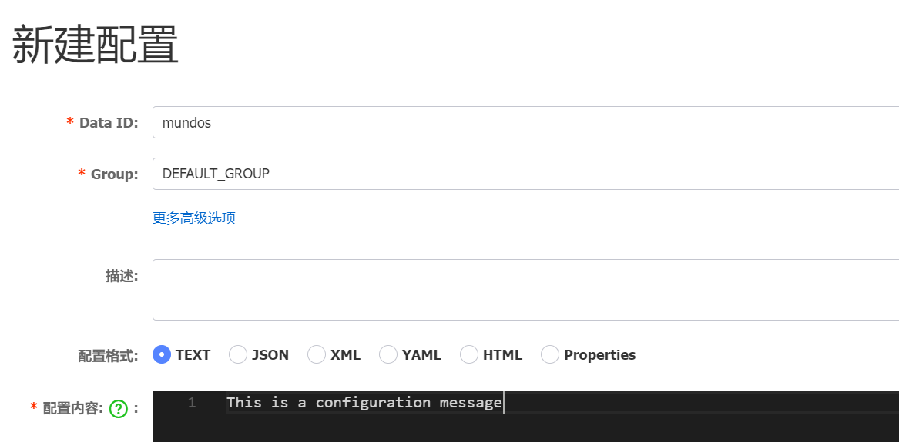

我们使用下面这个命令来安装Nacos库

```bash
go get -u github.com/nacos-group/nacos-sdk-go
```

安装完后，我们就可以给Nacos的配置做增删改查了。

在代码中，一般要引入这些模块的内容：

```go
"github.com/nacos-group/nacos-sdk-go/clients"
"github.com/nacos-group/nacos-sdk-go/common/constant"
"github.com/nacos-group/nacos-sdk-go/vo"
```

我们先看新增操作，在页面上，新增操作是这样的，首先我们选一个Namespace，点击新增：



需要指定四样东西：DataId、Group、配置格式、配置内容。

我们使用Go代码操作，首先指定服务器配置：

```go
sc := []constant.ServerConfig{
	{
		IpAddr: "10.40.18.34",
		Port:   8848,
	},
}
```

然后我们创建客户端配置，这里主要就是指定往哪个命名空间写内容：

需要保证Namespace存在，因为这一步不会主动在Nacos里创建Namespace。这个`NamespaceId`是这里的值，并不是命名空间名称：


```go
cc := constant.ClientConfig{
	NamespaceId:         "develop", // 如果往public命名空间里写配置，这一项不用添加，或者添加为空字符串
	TimeoutMs:           5000,
	NotLoadCacheAtStart: true,
	Username:            "nacos",
	Password:            "nacos",
}
```

创建客户端：

```
client, err := clients.CreateConfigClient(map[string]interface{}{
	"clientConfig":  cc,
	"serverConfigs": sc,
})
```

发布配置信息（这里我们利用了反引号，让json字符串看起来更加美观）：

```go
jsonString := `{"name": "John Doe", "age": 30, "city": "New York"}`
_, err = client.PublishConfig(vo.ConfigParam{
	DataId:  "mundo677",
	Group:   "DEFAULT_GROUP",
	Content: jsonString,
	Type: vo.JSON,  // 非必填，如果不填默认为text
})
```

这样，一个配置就创建好了。如果我们想修改配置，也是调用这个`PublishConfig`方法，根据Group和DataId指定想修改的配置，它会把新的配置信息覆盖上去。

如果是删除配置，就使用下面的代码：

```go
_, err = client.DeleteConfig(vo.ConfigParam{
	DataId: "mundo677",
	Group:  "DEFAULT_GROUP",
})
```

