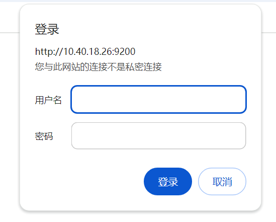
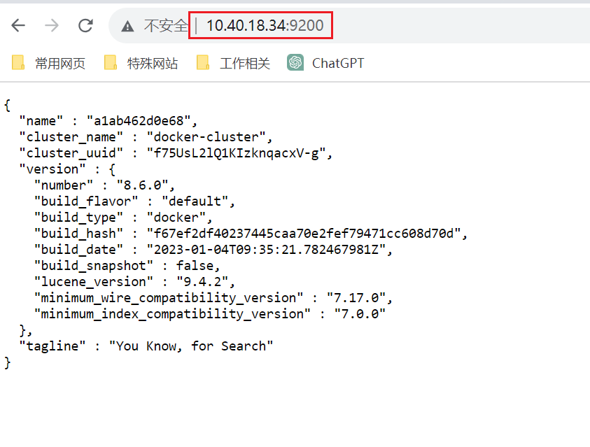

为了方便后续部署`Kibana`容器，我们可以先新建一个网络，以确保`ES`和`Kibana`容器能够互相连接：

```bash
docker network create es-net
```

我们拉取`ES`镜像，这里选择`8.7.0`版本（原`elasticsearch:8.6.0`镜像已不可用）：

```sh
docker pull elasticsearch:8.6.0 # 原来使用的命令，现已不可用
docker pull docker.elastic.co/elasticsearch/elasticsearch:8.7.0
```

创建需要挂载的目录（这里自己选择合适的位置）：

```bash
mkdir -p /srv/docker/es/data /srv/docker/es/config /srv/docker/es/plugins
```

更改目录权限：

```bash
chmod 777 /srv/docker/es/data
chmod 777 /srv/docker/es/config
chmod 777 /srv/docker/es/plugins
```

使用以下命令创建`ES`容器，这里创建的容器只是为了拿到其配置文件：

```bash
docker run -d --name es \
    --restart=always \
    --network es-net \
    -p 9200:9200 \
    -p 9300:9300 \
    --privileged \
    -e "discovery.type=single-node" \
    -e "ES_JAVA_OPTS=-Xms512m -Xmx512m" \
    docker.elastic.co/elasticsearch/elasticsearch:8.7.0
```

我们发现`ES`容器对外暴露了两个端口：

- `9200`端口是`Elasticsearch`的主要`HTTP RESTful API`端口，允许通过`HTTP`协议与`Elasticsearch`进行交互，用于执行索引、搜索和获取集群信息等操作。
- `9300`端口则用于`Elasticsearch`节点之间的内部通信，采用`Elasticsearch`自定义的二进制协议。这个端口上的通信主要负责集群内节点的协调与数据传输。

其余的选项讲解：

- `--privileged`：授予容器几乎与主机系统相同的权限。这意味着容器内的进程可以访问更多的硬件设备、执行更广泛的系统调用，并且能够访问到更多的主机资源。
- `-e "discovery.type=single-node"`：指定`ES`为单节点模式启动，不会尝试发现其他节点。这适用于开发、测试环境。
- `-e "ES_JAVA_OPTS=-Xms512m -Xmx512m"`：用于配置`ES`的`JVM`启动参数，这里配置了堆内存的初始大小和最大大小。

将`ES`容器中的配置文件目录复制到本地：

```sh
docker cp es:/usr/share/elasticsearch/config /srv/docker/es
```

停止并移除之前创建的容器，使用下面命令重新创建容器：

```sh
docker run -d --name es \
    --restart=always \
    --network es-net \
    -p 9200:9200 \
    -p 9300:9300 \
    --privileged \
    -v /srv/docker/es/data:/usr/share/elasticsearch/data \
    -v /srv/docker/es/plugins:/usr/share/elasticsearch/plugins \
    -v /srv/docker/es/config:/usr/share/elasticsearch/config \
    -e "discovery.type=single-node" \
    -e "ES_JAVA_OPTS=-Xms512m -Xmx512m" \
    docker.elastic.co/elasticsearch/elasticsearch:8.7.0
```

进入`ES`容器：

```bash
docker exec -it es /bin/bash
```

进入下面目录：

```sh
cd /usr/share/elasticsearch/config
```

执行下面命令：

```bash
grep -q '^xpack.security.enabled:' elasticsearch.yml && \
sed -i 's/^xpack.security.enabled:.*/xpack.security.enabled: false/' elasticsearch.yml || \
echo 'xpack.security.enabled: false' >> elasticsearch.yml
```

这个命令的作用是关闭密码安全验证。如果不关闭，访问`ES`页面时会弹出下面的登录框：



执行命令后退出容器，重启`ES`容器（这一步很重要，否则关闭密码安全验证不会生效）。

使用浏览器访问下方网址（替换为服务器`IP`地址），需要等待`2`分钟，启动较慢：

```
http://10.40.18.34:9200
```

出现下方这个`JSON`字符串，代表容器启动成功：


