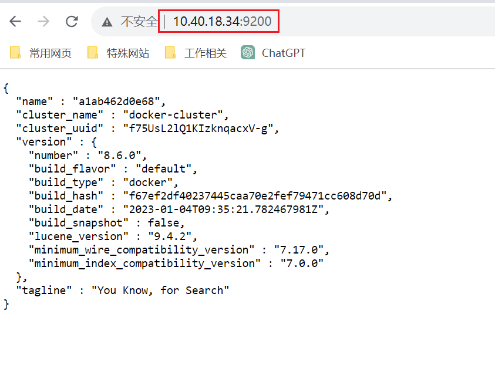

因为我们后面还需要部署Kibana容器，所以需要让es和Kibana容器互联

```bash
docker network create es-net
```

拉取ES镜像

```bash
docker pull elasticsearch:8.6.0
```

创建需要挂载的目录

```bash
mkdir -p /home/docker/es/data /home/docker/es/config /home/docker/es/plugins
```

更改目录权限

```bash
chmod 777 /home/docker/es/data
chmod 777 /home/docker/es/config
chmod 777 /home/docker/es/plugins
```

使用以下命令创建ES容器

```bash
docker run -d \
--restart=always \
--name es \
--network es-net \
-p 9200:9200 \
-p 9300:9300 \
--privileged \
-e "discovery.type=single-node" \
-e "ES_JAVA_OPTS=-Xms512m -Xmx512m" \
elasticsearch:8.6.0
```

9200端口是Elasticsearch的主要HTTP RESTful API端口。通过这个端口，可以使用HTTP协议进行与Elasticsearch的交互，执行索引、搜索、获取集群信息等各种操作。

9300端口用于Elasticsearch节点之间的内部通信，它使用的是Elasticsearch自定义的二进制协议。这个端口上的通信主要用于集群内节点之间的协调和数据传输。

拿出es容器中的配置文件所在目录到本地：

```sh
docker cp es:/usr/share/elasticsearch/config /home/docker/es
```

停止并移除之前创建的容器，重新创建容器：

```sh
docker run -d \
--restart=always \
--name es \
--network es-net \
-p 9200:9200 \
-p 9300:9300 \
--privileged \
-v /home/docker/es/data:/usr/share/elasticsearch/data \
-v /home/docker/es/plugins:/usr/share/elasticsearch/plugins \
-v /home/docker/es/config:/usr/share/elasticsearch/config \
-e "discovery.type=single-node" \
-e "ES_JAVA_OPTS=-Xms512m -Xmx512m" \
elasticsearch:8.6.0
```

进入docker es容器

```bash
docker exec -it es /bin/bash
```

进入 **config 目录**，执行下面命令：

```bash
cd config
sed -i 's/^xpack.security.enabled:.*/xpack.security.enabled: false/' elasticsearch.yml
```

这个命令的作用是关闭密码安全验证。

然后退出容器，重启 es 容器，访问网页（需要等待2分钟，启动较慢）：

```
http://10.40.18.34:9200
```



出现下面这个json，表示安装成功！