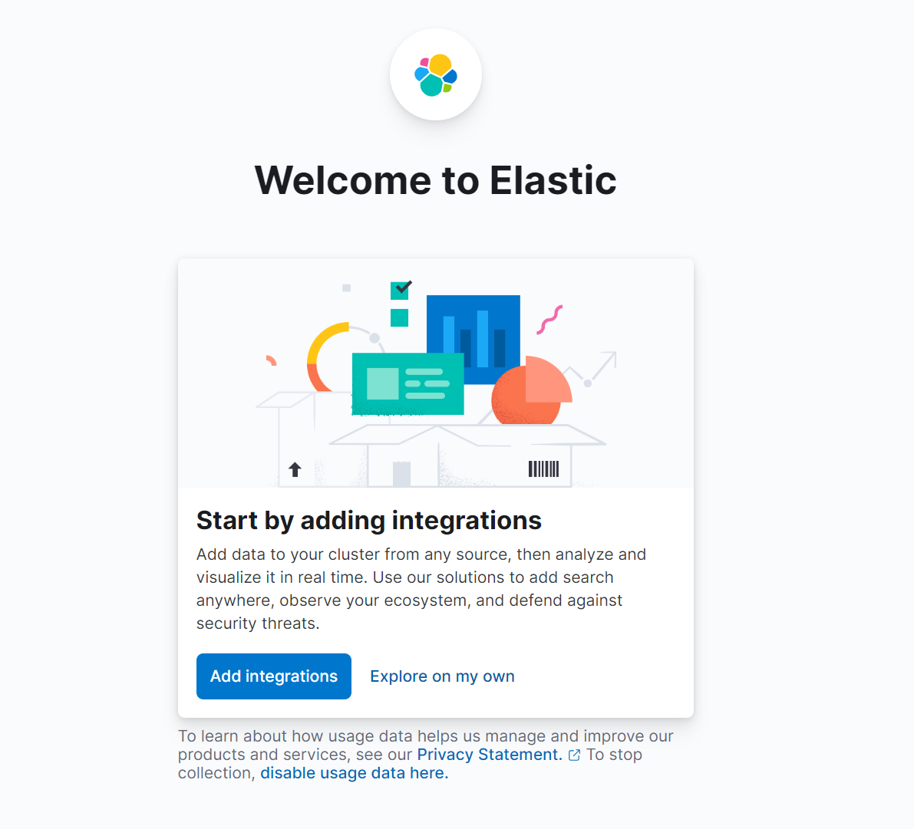

拉取Kibana镜像

```bash
docker pull kibana:8.6.0
```

创建挂载目录

```bash
mkdir -p /home/docker/kibana/config /home/docker/kibana/data
```

给目录更改权限

```bash
chmod 777 /home/docker/kibana/config
chmod 777 /home/docker/kibana/data
```

创建Kibana容器

```bash
docker run -d \
--restart=always \
--name kibana \
--network es-net \
-p 5601:5601 \
-e ELASTICSEARCH_HOSTS=http://es:9200 \
kibana:8.6.0
```

拿出Kibana容器中的配置文件所在目录到本地：

```sh
docker cp kibana:/usr/share/kibana/config /home/docker/kibana
```

停止并移除之前创建的容器，用下面的命令重新创建：

```sh
docker run -d \
--restart=always \
--name kibana \
-v /home/docker/kibana/config:/usr/share/kibana/config \
-v /home/docker/kibana/data:/usr/share/kibana/data \
--network es-net \
-p 5601:5601 \
-e ELASTICSEARCH_HOSTS=http://es:9200 \
kibana:8.6.0
```

访问网址（启动稍慢，需要等待2分钟）：

```
http://10.40.18.34:5601
```



出现这个页面，表示访问成功！

