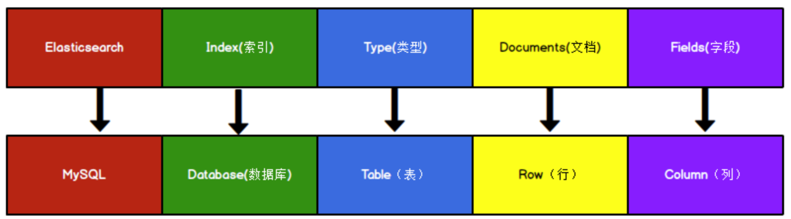

上一节我们讲了倒排索引的概念，这一节我们重点讲一下ES的概念篇。

首先我们先了解一下什么是ES。我们先知道一个ELK Stack，也就是Elasticsearch、Logstash和Kibana这三个技术栈的合称，其中Elasticsearch简称为ES，是一个开源的分布式搜索和分析引擎，是ELK Stack技术栈的核心。

我们知道我们做搜索时，做的都是模糊查询，例如我们要查name字段包含“苹果”的字段，SQL语句是这样：

```sql
select * from table where name like "%苹果%";
```

这样有一个问题，即使name字段上有索引，这样也会导致索引失效。在数据量巨大的时候，搜索效率很低。并且对于索引的维护也非常麻烦，每次insert或者update都会重新构建索引。

并且用户在做查询时，不一定非要以name为查询字段，可能查询的是其他的字段，如果每一种都做一个查询框，太过复杂。我们想用一个查询框就解决这个问题。

所以ES技术应运而生，ES工作原理是计算机索引程序通过扫描文章中的每一个词，对每一个词建立一个索引，指明该词在文章中出现的次数和位置，当用户查询时，检索程序就根据事先建立的索引进行查找，并将查找的结果反馈给用户的检索方式。这个过程类似于通过字典中的检索字表查字的过程。

我们把ES的相关概念和关系型数据库（例如MySQL）进行一个对比：



这里Type的概念已经被弱化， Elasticsearch 6.X 中，一个 index 下已经只能包含一个type， Elasticsearch 7.X 中, Type 的概念已经被删除了。

上面有看到，ES中的Type对应的是数据库的表，那么Type概念删除后，什么概念去对应这个表呢？

创建数据库表需要设置字段名称，类型，长度，约束等；索引库也一样，需要知道这个类型下有哪些字段，每个字段有哪些约束信息，这就叫做映射(mapping)。

有没有一个疑问，映射和类型看起来功能都是一样的，为什么要区分开来，作为两个不同的概念呢？我们前面说过，在Elasticsearch 6.X 前的版本（不包括本身），一个index下可以有多个type，每个type其实就对应了一个映射（mapping），在Elasticsearch 6.X以后，一个index下只能包含一个type，那么也就是说一个index只对应单一的mapping，那么就完全可以把type这个概念去掉，让index直接对应mapping。