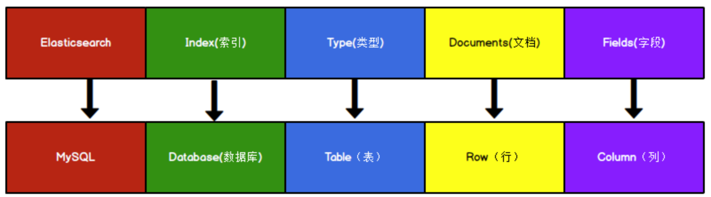

上一节我们介绍了倒排索引的概念，本节将重点讲解`ES`（`Elasticsearch`）的相关内容。

首先，我们需要了解`ES`的基本概念。`ES`是`ELK Stack`中的核心组件之一。`ELK Stack`指的是`Elasticsearch`、`Logstash`和`Kibana`这三个技术栈的组合，其中`Elasticsearch`（简称`ES`）是一个开源的分布式搜索和分析引擎。

在进行搜索时，我们通常会进行模糊查询。例如，要查找`name`字段中包含“苹果”的记录，`SQL`语句如下：

```sql
select * from table where name like "%苹果%";
```

这个查询存在一个问题，即使`name`字段上有索引，`LIKE "%苹果%"`这样的查询模式会导致索引失效，从而使搜索效率降低，特别是在数据量巨大的情况下。此外，索引的维护也相当复杂，每次`INSERT`或`UPDATE`操作都会重新构建索引。

此外，用户在查询时可能会使用不同的字段进行搜索。如果为每个字段设置一个单独的查询框会过于复杂。因此，我们希望能够通过一个通用的查询框来解决这个问题。

因此，`ES`（`Elasticsearch`）技术应运而生。`ES`的工作原理是：计算机索引程序会扫描文档中的每一个词，并为每个词建立索引，记录该词在文档中出现的次数和位置。当用户发起查询时，检索程序会根据事先建立的索引进行查找，并将结果反馈给用户。这一过程类似于在字典中查找单词的过程。

我们把`ES`的相关概念和关系型数据库（例如`MySQL`）进行一个对比：



在`Elasticsearch`中，`Type`的概念已被弱化。在`Elasticsearch 6.x`中，每个`index`下只能包含一个`type`，而在`Elasticsearch 7.x`中，`Type`的概念已被彻底删除。

在旧版本的`Elasticsearch`中，`Type`类似于数据库中的表。`Type`的删除后，`index`直接对应于`mapping`（映射）。在创建数据库表时，我们需要定义字段名称、类型、长度、约束等。同样，在`Elasticsearch`中，我们也需要知道每个`index`下有哪些字段以及它们的约束信息，这就是`mapping`。

这会引发一个疑问：`mapping`和`type`看起来功能类似，为什么要将它们区分为两个不同的概念？在`Elasticsearch 6.x`之前的版本中，一个`index`下可以包含多个`type`，每个`type`实际上对应一个`mapping`。从`Elasticsearch 6.x`开始，一个`index`下只能有一个`type`，即每个`index`只对应一个`mapping`。因此，`type`的概念变得多余，可以直接用`index`来对应`mapping`。