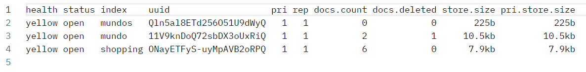

我们可以先检查已安装的`ES`版本信息。若`ES`是通过`Docker`安装的，可以先进入`Docker`容器内部：

```sh
docker exec -it es /bin/bash
```

使用以下命令查看`ES`的版本：

```sh
elasticsearch --version
```

确认到`ES`版本为`8.6.0`，因此需要使用以下库，我们用下面命令下载它：

```sh
go get github.com/elastic/go-elasticsearch/v8
```

如果`ES`版本为`7.x`，可以使用以下库（该库目前尚无`v8`版本）：

```sh
go get github.com/olivere/elastic/v7
```

我们这里使用第一个库，在代码中主要引入了这两个包：

```go
"github.com/elastic/go-elasticsearch/v8"
"github.com/elastic/go-elasticsearch/v8/esapi"
```

首先我们创建指定地址的`ES`的客户端：

```go
config := elasticsearch.Config{
	Addresses: []string{"http://10.40.18.40:9200"},
}
client, _ := elasticsearch.NewClient(config)
```

构建创建索引的请求：

```go
indexName := "mundos"
createIndexRequest := esapi.IndicesCreateRequest{
	Index: indexName,
}
res, _ := createIndexRequest.Do(context.Background(), client)
defer res.Body.Close()
```

执行后查看所有索引，可以看到对应条目：



删除索引代码如下：

```go
indexName := "mundos"
deleteIndexRequest := esapi.IndicesDeleteRequest{
	Index: []string{indexName},
}
res, _ := deleteIndexRequest.Do(context.Background(), client)
defer res.Body.Close()
```

重新查看所有索引，查看到该索引已经被删除了。

如果希望在创建索引时直接指定索引映射，代码如下所示：

```go
indexName := "mundos"
mapping := `
{
  "mappings": {
    "properties": {
      "name": {
        "type": "text"
      },
      "age": {
        "type": "integer"
      },
      "email": {
        "type": "keyword"
      }
    }
  }
}
`
createIndexRequest := esapi.IndicesCreateRequest{
	Index: indexName,
	Body: strings.NewReader(mapping),
}
res, _ := createIndexRequest.Do(context.Background(), client)
defer res.Body.Close()
```

映射的结构是我们通过`JSON`字符串所定义的。

