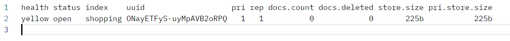

我们的`ES`实例安装在`10.40.18.40`服务器上，访问端口为`9200`。

在之前的学习中，我们了解到通过`HTTP RESTful API`与`Elasticsearch`（`ES`）进行数据交互。`RESTful API`是一种设计规范，旨在通过标准的`HTTP`方法（如`GET`、`POST`、`PUT`、`DELETE`）实现客户端与服务器之间的通信。其核心理念是将应用程序的状态表现为资源，并允许对这些资源进行操作。通过这种方式，`RESTful API`能够提供清晰、统一的接口，使得数据交换和服务调用更加高效和直观。

在`Elasticsearch`中，创建索引类似于在关系型数据库中创建数据库。例如，要创建一个名为`shopping`的索引，可以使用`Postman`发送一个`PUT`请求，其目标`URL`为：

```
http://10.40.18.40:9200/shopping
```

这个请求将会在`Elasticsearch`中创建一个新的`shopping`索引。

调用请求，得到返回信息：

```json
{
    "acknowledged": true,
    "shards_acknowledged": true,
    "index": "shopping"
}
```

如果重复发送这个`PUT`请求添加同样的索引，会返回一个错误信息，如下：

```json
{
    "error": {
        "root_cause": [
            {
                "type": "resource_already_exists_exception",
                "reason": "index [shopping/ONayETFyS-uyMpAVB2oRPQ] already exists",
                "index_uuid": "ONayETFyS-uyMpAVB2oRPQ",
                "index": "shopping"
            }
        ],
        "type": "resource_already_exists_exception",
        "reason": "index [shopping/ONayETFyS-uyMpAVB2oRPQ] already exists",
        "index_uuid": "ONayETFyS-uyMpAVB2oRPQ",
        "index": "shopping"
    },
    "status": 400
}
```

发送如下`GET`请求查看当前所有索引：

```
http://10.40.18.40:9200/_cat/indices?v
```

展示结果如下：



`/_cat/indices`表示使用 `Cat API` 来获取索引的信息，`?v`表示包含表头，也就是每个字段的列名。

如果我们想查看单个索引的信息，可以使用如下`GET`请求：

```
http://10.40.18.40:9200/shopping
```

它会以`JSON`格式返回该索引的详细信息：

```json
{
    "shopping": {
        "aliases": {},
        "mappings": {},
        "settings": {
            "index": {
                "routing": {
                    "allocation": {
                        "include": {
                            "_tier_preference": "data_content"
                        }
                    }
                },
                "number_of_shards": "1",
                "provided_name": "shopping",
                "creation_date": "1707012015444",
                "number_of_replicas": "1",
                "uuid": "k3QfyeU4RReCO0RPYrzDmw",
                "version": {
                    "created": "8060099"
                }
            }
        }
    }
}
```

使用`DELETE`请求删除这个`shopping`索引：

```
http://10.40.18.40:9200/shopping
```

返回结果如下：

```json
{
    "acknowledged": true
}
```

> **注意：** 删除索引会导致其所有关联文档被永久删除。即使之后重新创建一个同名索引，原有的文档也无法恢复。因此，删除索引是一个需要谨慎操作的过程，务必在执行前确认所有重要数据已备份或不再需要。