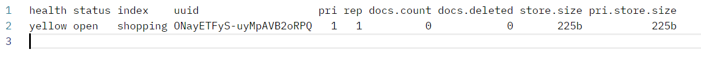

在前面我们学过，我们使用HTTP RESTful API端口9200与ES进行数据交互。

我们先复习下什么是RESTful API。RESTful API是一种设计规范，用于在客户端和服务器之间进行通信。RESTful API 的设计理念是将应用程序的状态以资源的形式暴露，并通过标准的 HTTP 方法（如 GET、POST、PUT、DELETE）进行操作。

这里我们的ES安装在`10.40.18.40`服务器上，访问端口号为9200

首先看对索引的操作，对比关系型数据库，创建索引就等同于创建数据库。

我们使用Postman发送PUT请求：`http://10.40.18.40:9200/shopping`，创建一个名为shopping的索引。

返回信息：

```json
{
    "acknowledged": true,
    "shards_acknowledged": true,
    "index": "shopping"
}
```

如果重复发送这个PUT请求添加索引，会返回一个错误信息，如下：

```json
{
    "error": {
        "root_cause": [
            {
                "type": "resource_already_exists_exception",
                "reason": "index [shopping/ONayETFyS-uyMpAVB2oRPQ] already exists",
                "index_uuid": "ONayETFyS-uyMpAVB2oRPQ",
                "index": "shopping"
            }
        ],
        "type": "resource_already_exists_exception",
        "reason": "index [shopping/ONayETFyS-uyMpAVB2oRPQ] already exists",
        "index_uuid": "ONayETFyS-uyMpAVB2oRPQ",
        "index": "shopping"
    },
    "status": 400
}
```

发送GET请求：`http://10.40.18.40:9200/_cat/indices?v`，可以查看当前所有索引。

结果如下：



`/_cat/indices`表示使用 Cat API 来获取索引的信息，`?v`表示包含表头，也就是每个字段的列名。

如果我们想查看单个索引的信息，可以使用GET请求：`http://10.40.18.40:9200/shopping`

它会把这个索引的详细信息以json形式返回给我们：

```json
{
    "shopping": {
        "aliases": {},
        "mappings": {},
        "settings": {
            "index": {
                "routing": {
                    "allocation": {
                        "include": {
                            "_tier_preference": "data_content"
                        }
                    }
                },
                "number_of_shards": "1",
                "provided_name": "shopping",
                "creation_date": "1707012015444",
                "number_of_replicas": "1",
                "uuid": "k3QfyeU4RReCO0RPYrzDmw",
                "version": {
                    "created": "8060099"
                }
            }
        }
    }
}
```

删除这个shopping索引，使用DELETE请求：`http://10.40.18.40:9200/shopping`

结果如下：

```json
{
    "acknowledged": true
}
```

需要注意的是，如果你删除了这个索引，那么它关联的所有文档都会被删除，即使你后面又创建了一个同名索引，文档也不会恢复。所以，删除索引是一个**谨慎的操作**，因为这将导致与该索引相关的所有数据丢失。请确保在执行删除操作之前，你已经仔细考虑并确认没有需要保留的数据。