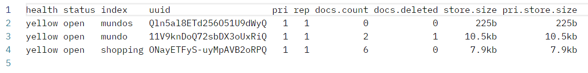

首先，我们先查看一下我们安装ES的版本，例如我们是用docker安装的ES，可以先进入docker容器内部：

```sh
docker exec -it es /bin/bash
```

使用如下命令查看ES的版本：

```sh
elasticsearch --version
```

查看到我的ES是Version: 8.6.0，所以要使用下面这个库：

```sh
go get -u github.com/elastic/go-elasticsearch/v8
```

如果是7.x的版本，可以使用下面这个库（这个库目前还没有v8版本）：

```sh
go get github.com/olivere/elastic/v7
```

我们这里使用v8那个版本。

引入这两个包：

```go
"github.com/elastic/go-elasticsearch/v8"
"github.com/elastic/go-elasticsearch/v8/esapi"
```

首先我们创建ES的客户端（忽略错误处理）：

```go
config := elasticsearch.Config{
	Addresses: []string{"http://10.40.18.40:9200"},
}
client, _ := elasticsearch.NewClient(config)
```

构建创建索引的请求：

```go
indexName := "mundos"
createIndexRequest := esapi.IndicesCreateRequest{
	Index: indexName,
}
res, _ := createIndexRequest.Do(context.Background(), client)
defer res.Body.Close()
```

运行，然后我们查看所有索引，就查看到了这一条：



删除索引：

```go
indexName := "mundos"
deleteIndexRequest := esapi.IndicesDeleteRequest{
	Index: []string{indexName},
}
res, _ := deleteIndexRequest.Do(context.Background(), client)
defer res.Body.Close()
```

重新查看所有索引，查看到该索引已经被删除了。

如果想在创建索引的时候就指定该索引的映射，代码应该这么写：

```go
indexName := "mundos"
mapping := `
	{
	  "mappings": {
		"properties": {
		  "name": {
			"type": "text"
		  },
		  "age": {
			"type": "integer"
		  },
		  "email": {
			"type": "keyword"
		  }
		}
	  }
	}
`
createIndexRequest := esapi.IndicesCreateRequest{
	Index: indexName,
	Body: strings.NewReader(mapping),
}
res, _ := createIndexRequest.Do(context.Background(), client)
defer res.Body.Close()
```

映射的结构是我们通过JSON字符串所确定的。

