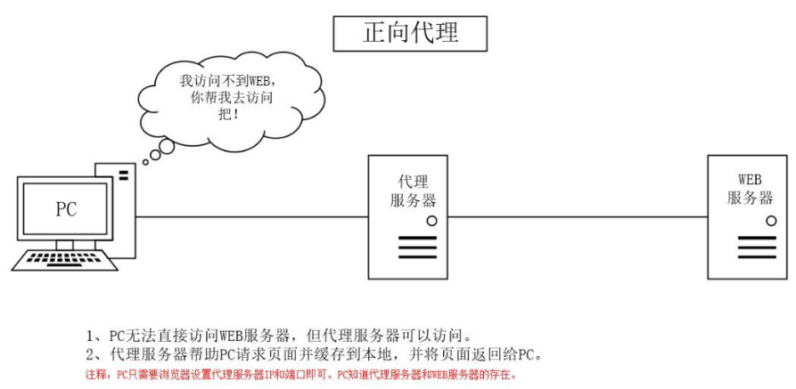
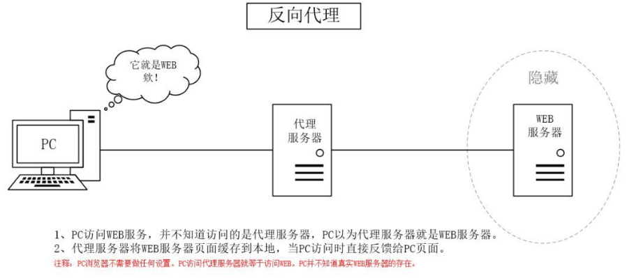

`Nginx`是一款高性能的开源`Web`服务器，同时支持反向代理、负载均衡和`HTTP`缓存等功能。

### 一、正向代理

正向代理是一种代理服务器为客户端服务的架构，代理服务器代表客户端，向目标服务器发起请求。

这种代理方式通常出现在以下场景中：

- 客户端无法直接访问目标服务器（例如无法访问外部互联网）。
- 绕过防火墙或其他访问限制。
- 隐藏客户端的真实`IP`地址。

例如，用户在进行科学上网时，希望访问无法直接访问的外部网站。此时，用户可以通过一个可以访问外网的代理服务器，将请求转发给目标网站，并将响应返回给用户。这样，目标`Web`服务器只会看到来自代理服务器的请求，而无法直接识别实际的客户端。

正向代理的示意图如下所示：

在`HTTPS`正向代理场景中，客户端通常通过`CONNECT`方法请求代理服务器与目标服务器建立`TCP`隧道。代理服务器完成与目标服务器的连接后，向客户端返回连接建立成功的响应，并进入隧道转发模式，在客户端与目标服务器之间持续双向转发数据。此时，客户端与目标服务器之间仍保持端到端的`TLS`通信，代理服务器通常只能获知目标主机、端口以及部分`TLS`握手元数据，而无法直接读取受`TLS`保护的`HTTP`请求头、请求体、响应头和响应体等应用层数据。

如果代理服务器需要对`HTTPS`流量进行解密和分析，则不能仅采用普通的`CONNECT`隧道转发方式，而需要由代理服务器分别与客户端和目标服务器建立独立的`TLS`连接，使代理成为两侧`TLS`通信的终止点。

此情形下，客户端需要将代理服务器使用的根`CA`证书加入自身的信任体系，该信任过程通常需要手动完成，系统也会针对这一操作给出安全风险提示。客户端完成信任后，代理服务器会根据目标域名动态签发服务器证书，并与客户端建立一条`TLS`连接；与此同时，代理服务器以客户端身份与目标服务器建立另一条独立的`TLS`连接。

通过这种方式，代理服务器可以分别解密客户端侧和目标服务器侧的`TLS`流量，对解密后的`HTTP`明文进行分析或处理，再根据流量方向，通过对应一侧的`TLS`连接重新加密，并将数据转发至客户端或目标服务器。

上述情况适用于客户端直接访问目标服务器地址的场景。但如果客户端访问的是中转服务器地址，则客户端会先与中转服务器建立`TLS`连接。中转服务器作为`TLS`终止点，可以解密并处理`HTTPS`流量，然后再与最终目标服务器建立新的`TLS`连接。由于两段`TLS`连接彼此独立，中转服务器可以对流量进行解密、处理，再重新加密后转发至最终目标服务器。

正向代理在网络地址转换中与`SNAT`（`Source NAT`，源地址转换）存在一定的相似性。从最终效果来看，它与`SNAT`都能够隐藏客户端身份。不过，两者的实现原理和应用场景并不相同。`SNAT`属于网络层地址转换技术，仅负责修改数据包的源地址；而正向代理工作在应用层，不仅能够隐藏客户端地址，还可以实现请求缓存、内容过滤、访问控制等功能。

### 二、反向代理

反向代理是一种代理服务器为目标服务器服务的架构，代理服务器代表目标服务器，向客户端提供服务。

这种代理方式常见的用途包括：

- 负载均衡：将请求分发到集群部署的服务器中的某一台，以优化资源利用。
- 提升安全性：隐藏真实服务器的`IP`地址，减少攻击风险。

在访问网站时，反向代理服务器会接收客户端的请求，转发给实际的服务器，并从服务器接收响应返回给客户端。客户端与真实服务器之间没有直接的通信，所有交互都通过反向代理服务器进行。

反向代理的示意图如下所示：

在反向代理中，通常会有多个真实的`Web`服务器进行集群部署。代理服务器通过负载均衡策略，将请求分发到集群中的某台服务器，以避免单一服务器的过载，并提高系统的可用性和扩展性。

在`HTTPS`反向代理场景中，反向代理服务器通常会作为客户端`TLS`连接的终止点。客户端首先与代理服务器建立`TLS`连接，由代理服务器完成`TLS`握手并解密`HTTPS`流量。此时，客户端与代理服务器之间建立的`TLS`连接已经在反向代理处终止，代理服务器可以获取其中的`HTTP`请求，并对请求数据进行处理。随后，代理服务器再根据负载均衡、路由等策略，将请求转发至后端服务器。

后端服务器返回响应后，代理服务器接收并处理响应数据，再通过已经建立的`TLS`连接重新加密并返回给客户端。整个过程中只存在客户端与反向代理之间的`TLS`连接，客户端无法感知访问的目标是代理服务器还是后端服务器。

如果反向代理与后端服务器之间同样使用`HTTPS`，那么代理服务器在终止客户端侧的`TLS`连接后，还会以客户端身份与后端服务器重新建立一条独立的`TLS`连接。此时，客户端与反向代理、反向代理与后端服务器之间分别存在两条相互独立的`TLS`连接。代理服务器可以解密并处理客户端侧的流量，然后通过另一条`TLS`连接重新加密并转发至后端服务器。

在证书信任方面，客户端验证的是反向代理提供的服务器证书。只要该证书由客户端系统或浏览器默认信任的`CA`签发，客户端即可按照正常的`HTTPS`证书验证流程建立信任。若反向代理与后端服务器之间继续使用`HTTPS`，则由反向代理作为`TLS`客户端验证后端服务器提供的服务器证书，两段`TLS`连接分别建立独立的证书信任关系，彼此互不影响。

反向代理在网络地址转换中与`DNAT`（`Destination NAT`，目标地址转换）存在一定的相似性。从最终效果来看，它与`DNAT`都能够隐藏内部服务器身份，实现对外提供统一访问入口。不过，两者的实现原理和应用场景并不相同。`DNAT`属于网络层地址转换技术，仅负责修改数据包的目标地址，将外部请求转发到内部服务器；而反向代理工作在应用层，不仅能够隐藏后端服务器地址，还可以实现负载均衡、请求过滤、缓存加速、`HTTPS`请求的`TLS`终止等功能。