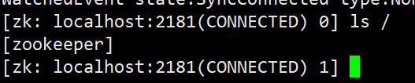

kafka依赖zookeeper运行，所以我们需要先安装zookeeper

创建一个网络，指定网络类型为 bridge（桥接模式）

```shell
docker network create app-tier --driver bridge
```

拉取zookeeper镜像，这里我选用的是3.7.0版本，它能和kafka的7.0.0版本正常协调工作。

```bash
docker pull zookeeper:3.7.0
```

然后启动zookeeper的容器

```bash
docker run -d --name zookeeper \
	--restart always \
    --network app-tier \
    -p 2181:2181 \
    -e ALLOW_ANONYMOUS_LOGIN=yes \
    zookeeper:3.7.0
```

zookeeper的默认暴露端口是2181,。

-e ALLOW_ANONYMOUS_LOGIN=yes 的作用是设置允许匿名登录，表示任何人都可以连接到zookeeper服务器，而无需提供用户名和密码。这条配置不适合在生产环境中使用。

执行命令后，可以查看一下容器是否已经启动。

我们可以进入到zookeeper容器里，使用zookeeper客户端

```bash
docker exec -it zookeeper /bin/bash
```

运行zookeeper的客户端命令：

```
zkCli.sh
```

zookeeper的客户端shell已经被启动，然后我们执行以下命令：

```
ls /
```



出现以下内容，表示zookeeper已经成功启动。

使用quit命令可以退出zookeeper客户端，exit是不行的！