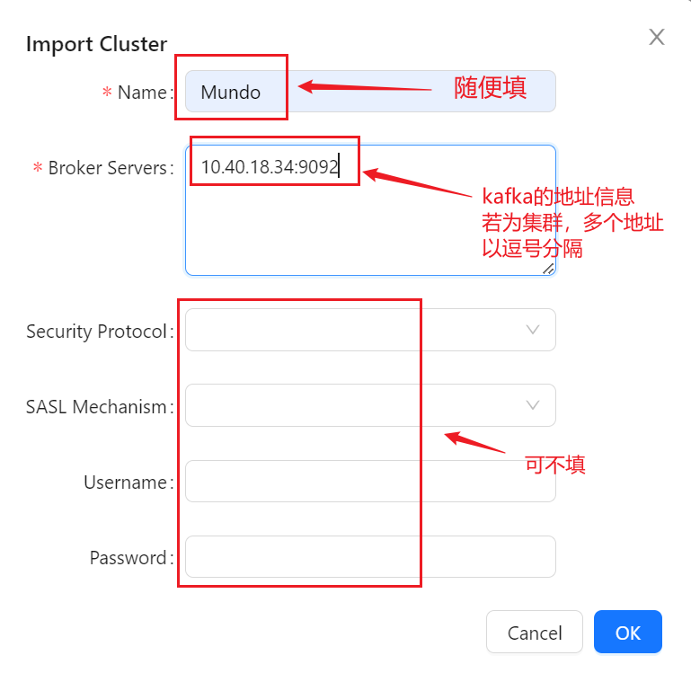
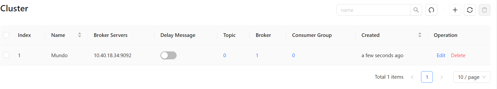

之前在安装zookeeper一节做了一些准备工作，这里安装一下kafka

拉取kafka的镜像

```bash
docker pull confluentinc/cp-kafka:7.0.0
```

创建kafka容器

```bash
docker run -d --name kafka \
	--restart always \
    --network app-tier \
    -p 9092:9092 \
    -e ALLOW_PLAINTEXT_LISTENER=yes \
    -e KAFKA_ZOOKEEPER_CONNECT=zookeeper:2181 \
    -e KAFKA_ADVERTISED_LISTENERS=PLAINTEXT://10.40.18.34:9092 \
    confluentinc/cp-kafka:7.0.0
```

| 参数                                                    | 描述                                                         |
| ------------------------------------------------------- | ------------------------------------------------------------ |
| ALLOW_PLAINTEXT_LISTENER=yes                            | 允许 Kafka 使用明文文本传输（不加密）。                      |
| KAFKA_ZOOKEEPER_CONNECT=zookeeper:2181                  | 设置 Kafka 连接到的 Zookeeper 服务的地址和端口。             |
| KAFKA_ADVERTISED_LISTENERS=PLAINTEXT://10.40.18.34:9092 | 设置 Kafka 容器对外公开的监听地址和端口。在这里，使用的是 10.40.18.34 的 IP 地址，并监听 9092 端口。 |

启动后，可以看一下kafka容器的日志，是否已经启动成功。

然后我们需要安装一个kafka的图形化管理工具，这里我们使用`kafka-map`

拉取它的镜像

```bash
docker pull dushixiang/kafka-map:v1.3.3
```

启动容器

```bash
docker run -d --name kafka-map \
    --network app-tier \
    -p 8001:8080 \
    -v /home/docker/kafka-map/data:/usr/local/kafka-map/data \
    -e DEFAULT_USERNAME=admin \
    -e DEFAULT_PASSWORD=admin \
    --restart always \
    dushixiang/kafka-map:v1.3.3
```

这里设置默认账号：admin，默认密码：admin。设置挂载目录（docker的挂载目录统一放到 /home/docker下）

启动后，使用 http://10.40.18.34:8001 访问。

dushixiang/kafka-map 是一个SpringBoot项目，内部服务器是tomcat，所以默认对外暴露的接口是8080，但是8080是一个常用的接口，在映射给宿主机时最好不要用8080，我这里选用了8001。

新建kafka连接的界面，名字随便起:



连接成功后是这样：



