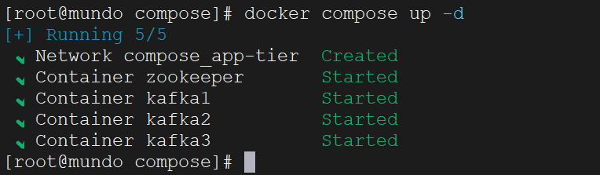
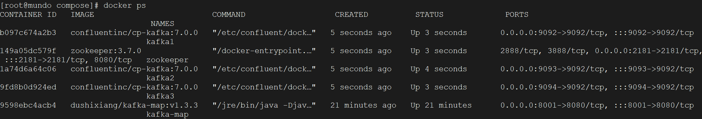
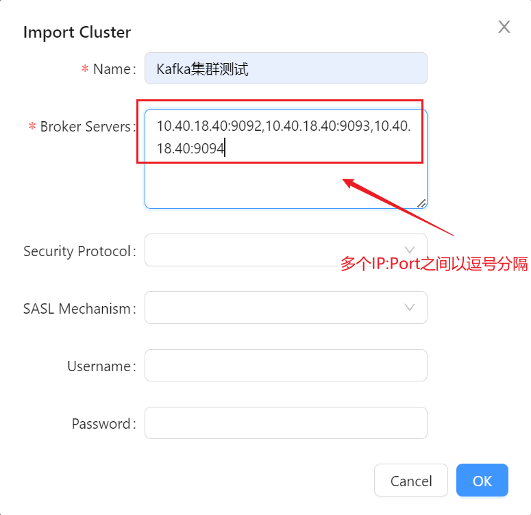
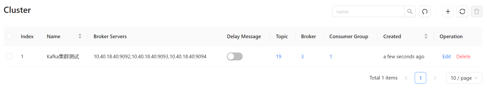

在前述Docker安装的步骤中，我们配置了单个Kafka实例，但在实际开发中，通常会部署一个Kafka集群，由多个broker共同协作。这种集群架构能够更好地支持应用需求，提供高可用性和伸缩性。

kafka的默认端口是9092，我们配置多个broker有两种常见方式，以三个broker为例：

```bash
IP:9092   IP:9093   IP:9094
IP1:9092  IP2:9092  IP3:9092
```

要么是不同的IP，要么是不同的port，这里为了方便，我们选择同个IP不同port的方式。

之前我们有讲过，只要多个Kafka实例连接到同一个zookeeper，它们就构成一个集群。所以我们选择用Docker Compose的方式创建这个zookeeper和Kafka集群。

首先创建一个`docker-compose.yml`文件：

```yaml
version: '3'
networks:
  app-tier:
    driver: bridge
    
services:
  zookeeper:
    image: zookeeper:3.7.0
    container_name: zookeeper
    restart: always
    networks:
      - app-tier
    ports:
      - "2181:2181"
    environment:
      ALLOW_ANONYMOUS_LOGIN: "yes"

  kafka1:
    image: confluentinc/cp-kafka:7.0.0
    container_name: kafka1
    restart: always
    networks:
      - app-tier
    ports:
      - "9092:9092"
    environment:
      KAFKA_ADVERTISED_HOST_NAME: 10.40.18.40
      ALLOW_PLAINTEXT_LISTENER: "yes"
      KAFKA_ZOOKEEPER_CONNECT: "zookeeper:2181"
      KAFKA_ADVERTISED_LISTENERS: PLAINTEXT://10.40.18.40:9092
      KAFKA_LISTENERS: PLAINTEXT://0.0.0.0:9092
      KAFKA_BROKER_ID: 1

  kafka2:
    image: confluentinc/cp-kafka:7.0.0
    container_name: kafka2
    restart: always
    networks:
      - app-tier
    ports:
      - "9093:9093"
    environment:
      KAFKA_ADVERTISED_HOST_NAME: 10.40.18.40
      ALLOW_PLAINTEXT_LISTENER: "yes"
      KAFKA_ZOOKEEPER_CONNECT: "zookeeper:2181"
      KAFKA_ADVERTISED_LISTENERS: PLAINTEXT://10.40.18.40:9093
      KAFKA_LISTENERS: PLAINTEXT://0.0.0.0:9093
      KAFKA_BROKER_ID: 2

  kafka3:
    image: confluentinc/cp-kafka:7.0.0
    container_name: kafka3
    restart: always
    networks:
      - app-tier
    ports:
      - "9094:9094"
    environment:
      KAFKA_ADVERTISED_HOST_NAME: 10.40.18.40
      ALLOW_PLAINTEXT_LISTENER: "yes"
      KAFKA_ZOOKEEPER_CONNECT: zookeeper:2181
      KAFKA_ADVERTISED_LISTENERS: PLAINTEXT://10.40.18.40:9094
      KAFKA_LISTENERS: PLAINTEXT://0.0.0.0:9094
      KAFKA_BROKER_ID: 3
```

切换到这个这个`docker-compose.yml`文件所在目录，使用下面命令启动：

```
docker compose up -d
```



查看是否启动成功：



启动成功了！

然后去kafka-map，连接一下这个kafka集群。

名字随便取，集群地址如下：

```
10.40.18.40:9092,10.40.18.40:9093,10.40.18.40:9094
```





连接成功！