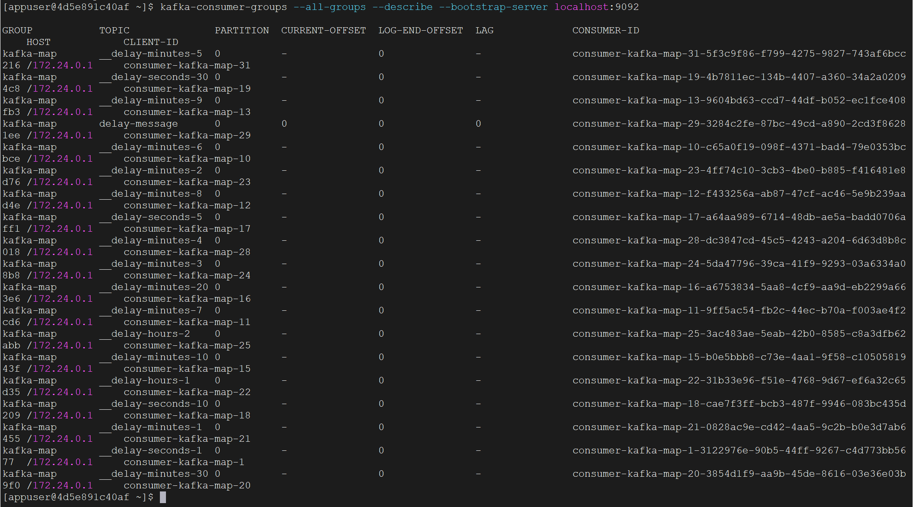

对于Kafka，最重要的内容之一就是消费者组了，这节说一下如何使用命令操作消费者组。

首先可以用如下命令查看一下所有消费者组：

```bash
kafka-consumer-groups --all-groups --describe --bootstrap-server localhost:9092
```

由于我使用kafka-map连接了这个Kafka集群，所以它展示下图结果：



这个结果包含了消费者组名、topic名、分区、消费位移等信息，这里的第一列：group，就是消费者组的名字。

过滤某一消费者组，展示某一消费者组的详细信息：

```bash
kafka-consumer-groups --describe --group kafka-map --bootstrap-server localhost:9092
```

重置消费者组的偏移量，例如将偏移量重置为最早的可用位置：

```bash
kafka-consumer-groups --group kafka-map --reset-offsets --to-earliest --execute --topic mundo-topic --bootstrap-server localhost:9092
```

Kafka没有提供直接删除消费者组的命令。消费者组通常由Kafka自动管理，当组中没有任何活跃的消费者时，Kafka会自动将其标记为过时并最终删除。 

Kafka也提供了一些直接消费指定topic消息的方法，使用的是`kafka-console-consumer`命令。

这个命令的参数格式是这样的：

```bash
kafka-console-consumer --topic <topic_name> --bootstrap-server <bootstrap_servers> [其他参数]
```

`<topic_name>`就是要消费的topic的名称，`<bootstrap_servers>`在docker环境下就是`localhost:9092`

其他一些常见参数有：

- `--from-beginning`: 从 topic 的开始位置消费消息。如果不指定这个参数，将从当前的 offset 开始消费。
- `--group `: 指定消费者组的名称。如果不指定，将使用默认的消费者组。
- `--property key=value`: 设置额外的消费者配置属性。

例如我们要查看`mundo-topic`这个topic的消息，并打印到控制台：

```bash
kafka-console-consumer --topic mundo-topic --bootstrap-server localhost:9092 --from-beginning
```

同时，这条命令也会进行监听，如果有新消息被打进来，它也会进行消费并输出。

在 Kafka 中，消息的保留时间是由配置参数 `log.retention.hours` 控制的。当消息被消费后，根据该配置的设置，消息可能仍然在磁盘上保留一段时间。

默认情况下，Kafka 的消息保留时间是七天 (`log.retention.hours=168`)。这意味着即使消息被消费，它们仍然会在 Kafka 中保留七天，之后会被自动清理。