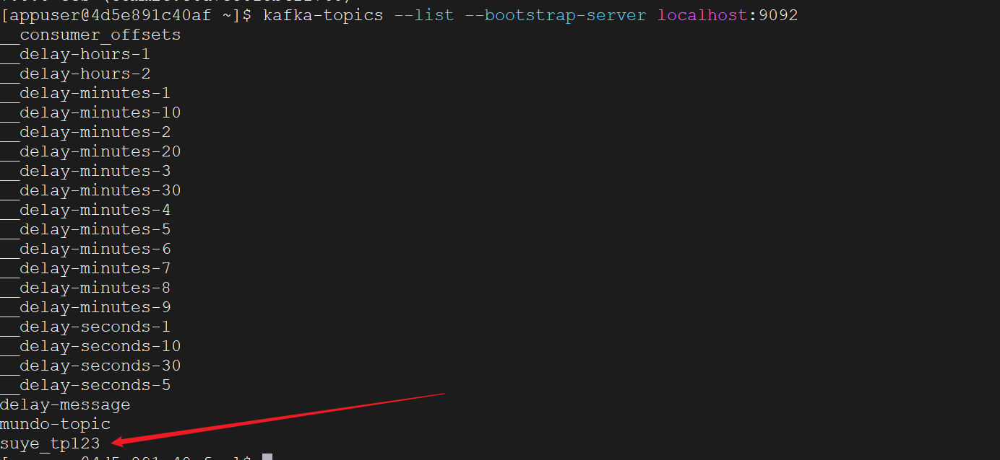
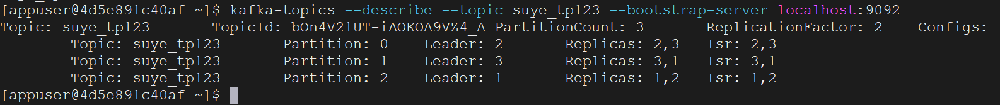

Go语言操作Kafka有两个常用的库：

```bash
go get -u github.com/IBM/sarama   # 原github.com/Shopify/sarama已不可用
go get -u github.com/segmentio/kafka-go
```

其中kafka-go 需要 Go 1.15或更高版本。

这里用哪个都可以，我先介绍一下使用`sarama`这个吧。

首先我们使用上面的命令，导入这个`sarama`包

之前我们有讲过使用命令去创建topic，这里我们用代码来完成此操作。

首先我们设置kafka集群地址，这里设置成一个string类型切片：

```go
brokers := []string{"10.40.18.40:9092", "10.40.18.40:9093", "10.40.18.40:9094"}
```

创建kafka配置，根据kafka版本7.0.0设置配置版本如下：

```go
config := sarama.NewConfig()
config.Version = sarama.V2_8_0_0 // 设置Kafka版本
```

创建 `ClusterAdmin` 实例（忽略error处理）：

```go
admin, _ := sarama.NewClusterAdmin(brokers, config)
```

设置我们要创建的topic信息：

```go
topicDetail := &sarama.TopicDetail{
	NumPartitions:     3,         // 设置分区数量
	ReplicationFactor: 2,         // 设置副本数量
	ConfigEntries:     map[string]*string{}, // 设置其他配置项
}
```

调用`CreateTopic`方法，创建topic，例如我们给它取名为`suye_tp123`：

```go
err = admin.CreateTopic("suye_tp123", topicDetail, false)
```

这里的第三个参数是`validateOnly`，如果为true，该方法仅验证配置是否正确，不会在kafka集群中创建实际的主题。如果为false，在验证配置的同时，如果一切正常，会在 Kafka 集群中创建实际的主题。

如果创建了一个已有的topic（重名），它会报错：

```
2024/01/26 11:09:24 Error creating topic: kafka server: Topic with this name already exists - Topic 'suye_tp123' already exists.
```

我们使用之前讲过的查询topic的命令，可以查到这个topic：

```bash
kafka-topics --list --bootstrap-server localhost:9092
```



或者查看这个topic的详细信息：

```bash
kafka-topics --describe --topic suye_tp123 --bootstrap-server localhost:9092
```



上面创建的admin，在代码结束后需要关闭掉：

```bash
defer admin.Close()
```

