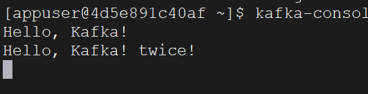

之前讲明白了Kafka的topic相关内容，这里我们讲一下生产者如何把消息发送到Kafka中。

首先还是指定好我们的Brokers：

```go
brokers := []string{"10.40.18.40:9092", "10.40.18.40:9093", "10.40.18.40:9094"}
```

创建配置信息，并指定一些配置内容：

```go
config := sarama.NewConfig()
config.Version = sarama.V2_8_0_0
config.Producer.RequiredAcks = sarama.WaitForAll
config.Producer.Retry.Max = 5
config.Producer.Return.Successes = true
```

其中，`config.Version`指定了我们配置的版本，和前文一样，指定为`sarama.V2_8_0_0`

`config.Producer.RequiredAcks`: 该配置项指定了生产者在发送消息后等待的确认级别。具体取值有三种：

- `sarama.WaitForLocal`：只要消息被成功写入本地 partition，就认为发送成功。
- `sarama.WaitForAll`：等待所有 ISR（In-Sync Replicas，与 leader 同步的副本）都确认收到消息后才认为发送成功。
- `sarama.NoResponse`：生产者发送消息后不等待任何确认。

`sarama.WaitForAll` 是常用的设置，因为它提供了更高的消息持久性，确保消息被所有同步副本接收。

`config.Producer.Retry.Max`：如果消息发送失败，生产者会进行重试。这个配置项指定了最大的重试次数。当达到最大重试次数后，生产者将不再尝试发送消息，并将错误返回给调用者。

`config.Producer.Return.Successes`：这个配置项指定了是否在成功发送消息后返回一个成功的消息通知。如果设置为 `true`，在成功发送消息后，`sarama.SyncProducer.SendMessage` 方法会返回一个 `sarama.ProducerMessage`，其中包含了消息被发送的 partition 和 offset 信息。

接下来，创建一个`producer`（忽略错误处理）：

```go
producer, _ := sarama.NewSyncProducer(brokers, config)
```

构建我们要发送的消息：

```go
topic := "suye_tp123"
message := "Hello, Kafka!"

msg := &sarama.ProducerMessage{
	Topic: topic,
	Value: sarama.StringEncoder(message),
}
```

发送消息（忽略错误处理）：

```go
partition, offset, _ := producer.SendMessage(msg)
```

这里的`partition`是分区，`offset`是偏移量，我们打印它出来：

```go
fmt.Printf("Message sent to partition %d at offset %d\n", partition, offset)
```

得到结果：`Message sent to partition 0 at offset 0`，说明被分到了第一个分区，偏移量为0。

我们再发送一个消息，打印这个消息的分区和偏移量。

得到结果：`Message sent to partition 0 at offset 1`

使用以下命令查看消息是否已经被打到Kafka：

```bash
kafka-console-consumer --topic suye_tp123 --bootstrap-server localhost:9092 --from-beginning
```



并且它还可以在此处监听，如果再有消息发送过来，还会打印到控制台上。