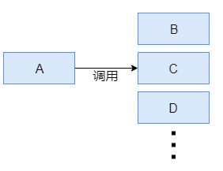
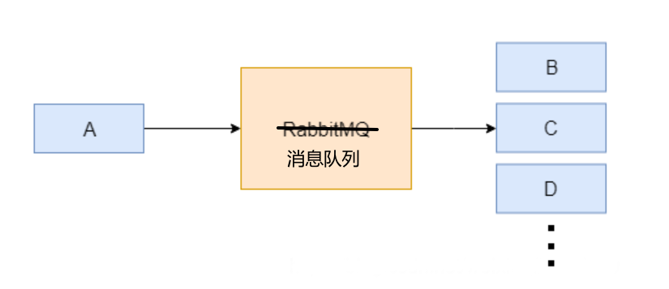
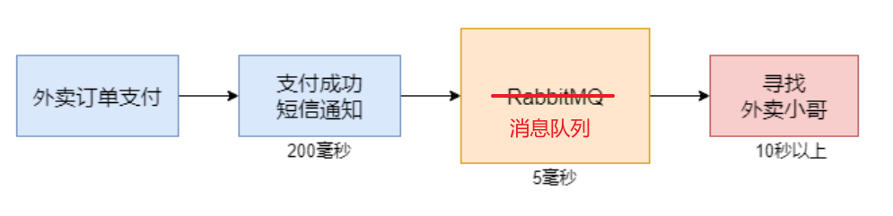
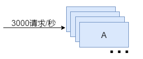
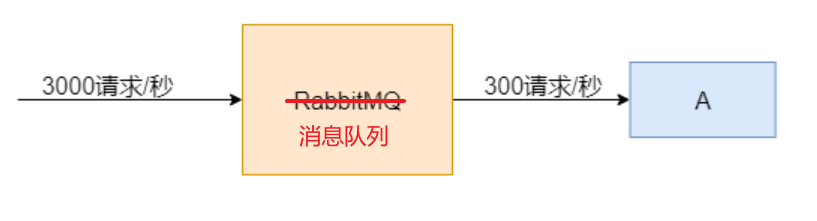

我们想一个问题，我们使用Kafka时，是先让生产者把消息发送到Kafka，然后消费者再去Kafka里进行消费。为什么要有这样一个过程？我们直接在代码里让生产者把数据发送给消费者不就可以了？为什么还要通过Kafka呢？

我们知道Kafka是一种消息队列，那么消息队列的适用场景就有以下几条：

1. 服务解耦合

通常适用于微服务场景中，不同服务之间有数据的交互。

生产者A生产数据，消费者B、C、D消费数据，那我们可以在A服务中直接调用B、C、D服务，把数据传递到下游服务即可。但是，如果不止3个服务呢，如果有几十甚至几百个下游服务，A中调用服务的代码量会很大，代码维护极为困难。

于是我们把生产者和消费者解耦，生产者和消费者之间通过Kafka进行通信，彼此之间不直接耦合。这意味着生产者可以独立于消费者，它们不需要了解对方的存在。

2. 异步通信

生产者和消费者之间的通信是异步的，生产者在将消息发送到Kafka后就可以继续执行其他任务，而消费者可以按照自己的速度处理消息。这种异步通信模式有助于提高系统的响应性和吞吐量。

例如这样一个消费场景，客户点外卖，支付后需要等待寻找外卖小哥这个过程，找到后，订单系统才会获得响应。寻找外卖小哥的耗时可能达到十几秒甚至几十秒，会造成整条调用链路的响应十分缓慢。

我们引入Kafka，这样的话，支付成功后，把任务发送进消息队列，支付端整条链路的调用就结束了，订单系统可以迅速获得响应。寻找外卖小哥的应用可以以异步的方式从消息队列中接受任务，再执行耗时的寻找操作。

3. 流量削峰

假设我们有一个应用。平时访问量每秒处理300个请求。我们用一台服务器就能完成它。

而在访问高峰期。访问量可能会在平时的10倍以上，达到每秒3000个请求。那么，单台服务器肯定无法完成任务，我们可以考虑使用十台服务器。来分散访问的压力。但是这种访问高峰期，可能每天只会出现几分钟。我们使用十台服务器的话，会造成很多资源的浪费。

所以我们可以考虑使用消息队列进行流量削峰。在某一高峰期，瞬间出现的大量请求会被送往消息队列中间件，排队等待被处理。这时我们的应用可以缓慢的从消息队列中间件中拿取数据进行处理，避免瞬时性的压力。

同时，Kafka的分布式特性允许通过添加更多的Broker来水平扩展系统。当系统面临峰值负载时，可以通过扩展Kafka集群来增加整体的处理能力，以更好地应对高流量。

除了上面这三个主要的使用场景外，还有一些其他的原因，表明使用Kafka的必要性：

1. 消息持久化：Kafka允许将消息持久化保存，即使消费者离线一段时间，它仍然可以获取到在离线期间发送的消息。因为消息首先被写入Kafka的Topic，然后被持久化保存在Broker中，而消费者可以按需拉取这些消息。
2. 容错性：Kafka是分布式的，具有多个Broker，每个Broker保存了Topic的一个或多个分区的副本。这样，即使某个Broker出现故障，其他Broker上仍然存在数据的副本，确保消息的可用性和容错性。

