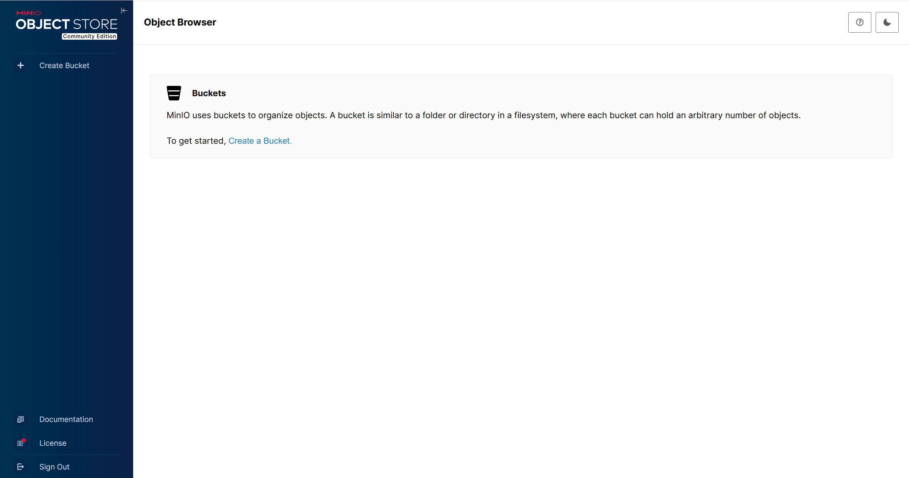
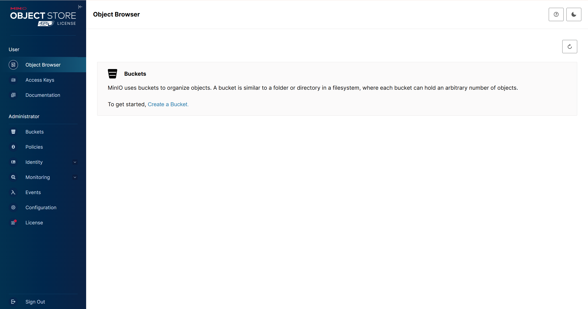

首先我们在`Linux`服务器上拉取`MinIO`的镜像：

```sh
docker pull minio/minio:RELEASE.2025-06-13T11-33-47Z
```

接下来使用下面命令创建`MinIO`的`Docker`容器：

```sh
docker run -d \
    --name minio \
    --restart=always \
    -p 9000:9000 \
    -p 9001:9001 \
    -e MINIO_ROOT_USER=admin \
    -e MINIO_ROOT_PASSWORD=1234567890 \
    -v /opt/minio/data:/data \
    -v /opt/minio/config:/root/.minio \
    minio/minio:RELEASE.2025-06-13T11-33-47Z \
    server /data --console-address ":9001"
```

其中，`9000`端口用于映射`MinIO`的`S3`(`Simple Storage Service`）接口，也就是基于`HTTP`协议对存储桶中的对象进行增删改查操作时所使用的端口；而`9001`端口则用于映射管理控制台，供用户通过网页进行访问和管理操作。

`MINIO_ROOT_USER`和`MINIO_ROOT_PASSWORD`用于配置访问凭据，这里注意密码不应低于`10`个字符，此处我们设置了一个简单的用户名和密码。同时，我们还将`MinIO`容器中的数据和配置映射到宿主机，实现持久化存储。

命令中的最后一部分：`server /data --console-address ":9001"`，指定`MinIO`以服务器模式启动，数据存储路径为`/data`，并通过`--console-address`参数将内置的`Web`控制台固定绑定在`9001`端口，而非每次随机分配端口。

创建完容器后，可以在浏览器输入下面的访问地址，访问`MinIO`的`Web`控制台：

```sh
http://<IP>:9001/
```

访问成功的网页如下所示：



`MinIO`官方于`2025`年`5`月对社区版策略进行了调整。最新版本的`Web`页面`UI`已剥离所有管理功能，包括用户与权限设置、策略管理、系统配置、生命周期管理、复制控制等，仅保留最基本的对象浏览功能，也就是仅支持查看桶与对象。对于管理功能，需要通过`MinIO`的客户端指令`mc`来完成，这部分内容后续会详细讲解。

如果希望通过`Web`界面管理更多功能，可以使用以下版本的`Docker`镜像：

```sh
docker pull minio/minio:RELEASE.2025-04-22T22-12-26Z
```

创建容器命令如下：

```sh
docker run -d \
    --name minio \
    --restart=always \
    -p 9000:9000 \
    -p 9001:9001 \
    -e MINIO_ROOT_USER=admin \
    -e MINIO_ROOT_PASSWORD=1234567890 \
    -v /opt/minio/data:/data \
    -v /opt/minio/config:/root/.minio \
    minio/minio:RELEASE.2025-04-22T22-12-26Z \
    server /data --console-address ":9001"
```

这样，再使用`admin`账户访问`MinIO`的`Web`界面时，就可以看到如下功能完善的页面：



上面部署的是一个单节点、单实例的`MinIO`服务，在生产环境中建议改为分布式部署，相关内容后续使用到再进行补充。
