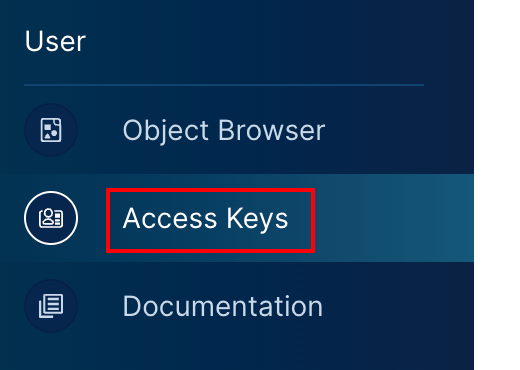
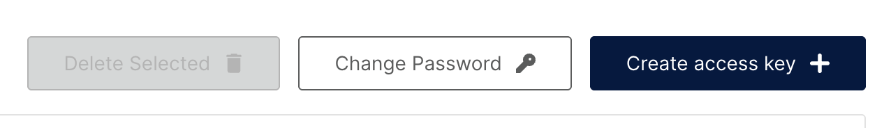
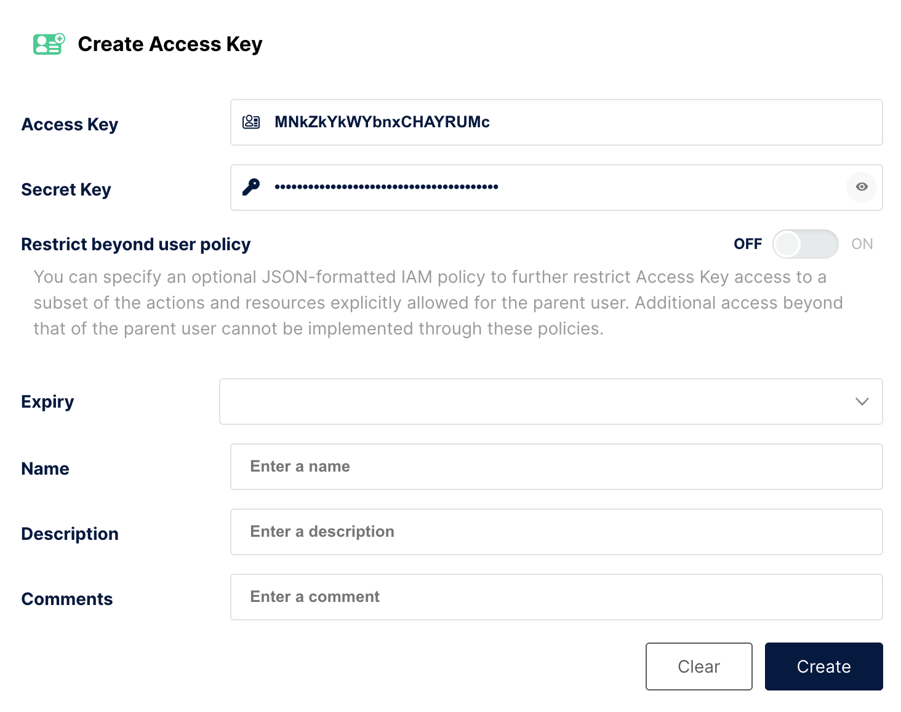
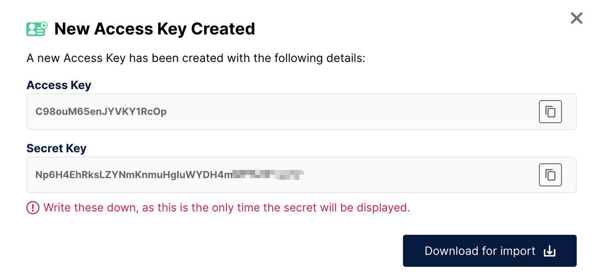
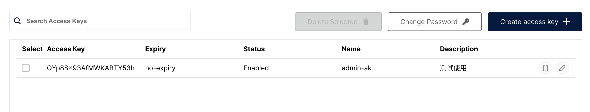

首先我们点到侧边栏的`User`里面的`Access Keys`：

这里面可以修改密码，以及生成`AccessKey`与`SecretKey`凭证信息：

点击`Create access key`，它会自动生成一对`AK/SK`，我们也可以手动修改它：

如果未选择`Expiry`，则默认不会过期。后续的`Name`、`Description`和`Comments`字段均为可选项。

点击创建后，系统会提示你手动保存`AK`和`SK`，并提供下载选项。关闭提示框后，`SK`将无法在平台上再次查看：

这样就可以在列表中查看到创建过的`AK`凭证信息：

除了页面创建的以外，`MinIO`账户的用户名和密码也是一对`AK/SK`，客户端可以将其作为连接凭证使用。