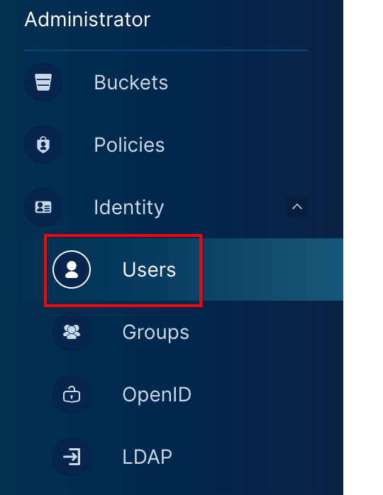
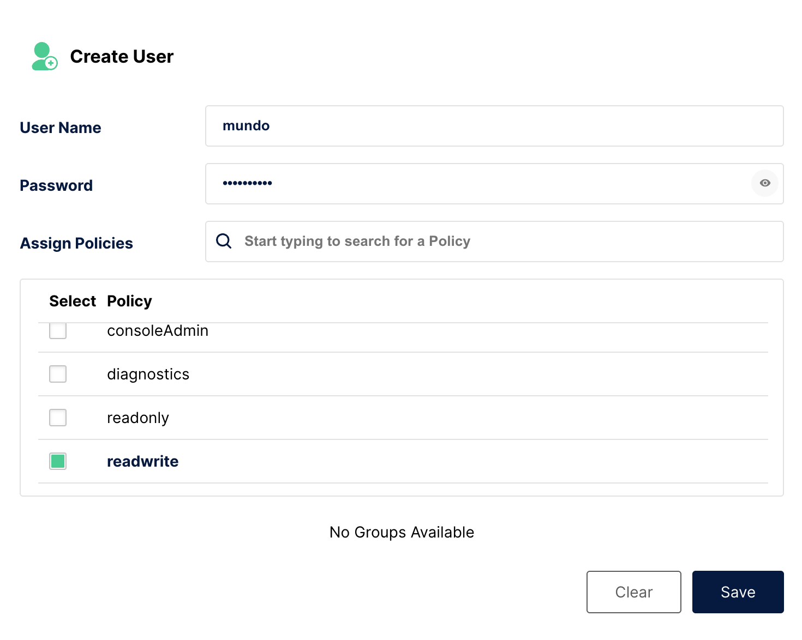
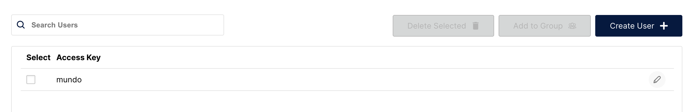
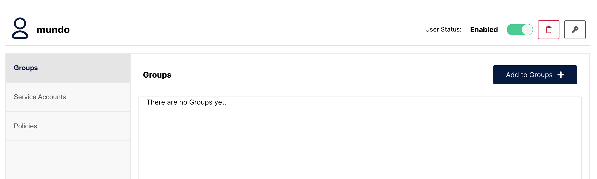
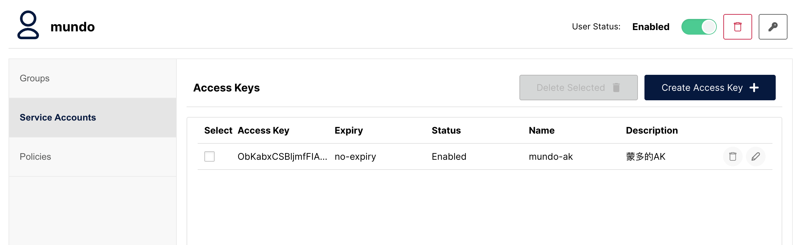
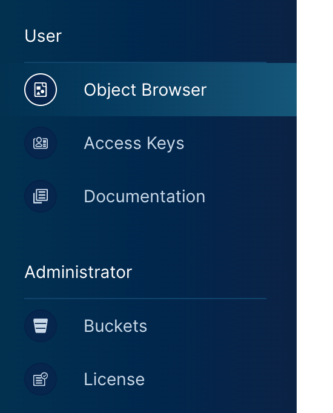

此操作仅限管理员执行。首先我们点击`Administrator`中的`Identity`里的`Users`：

在这里可以手动创建用户名和密码，并指定其权限策略。我们要创建的是普通用户，这里选择`readwrite`：

这样我们就可以在列表中看到创建的用户信息：

点击进入该用户主页后，可以执行启用或禁用账户、删除用户、更改密码等操作，还可以将其加入指定用户组：

我们也可以给该用户生成`AK`和`SK`凭证信息，页面操作同上一章内容：

使用平台创建的新用户的账户名和密码也可以用于登录平台，登录后侧边栏展示的内容如下所示：

我们可以看到在`readwrite`权限策略下，该用户仅有对`Buckets`及其内部对象进行管理的能力。