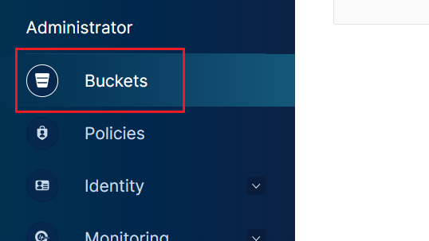
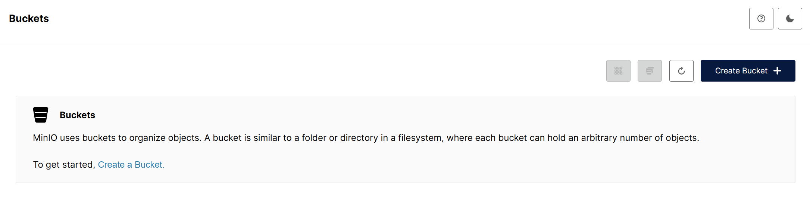
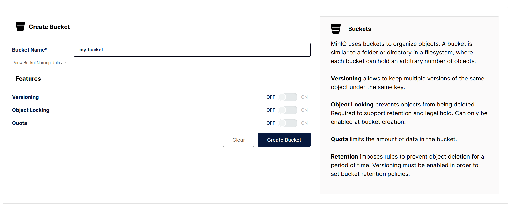
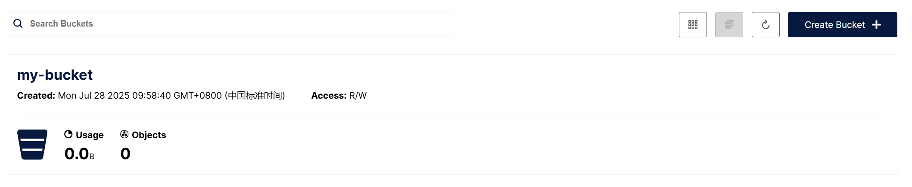
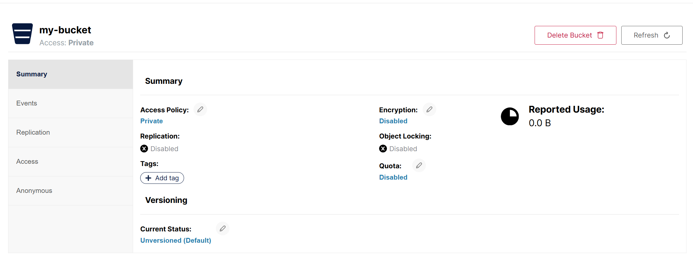
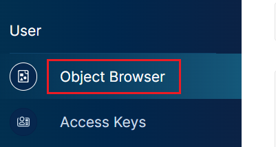
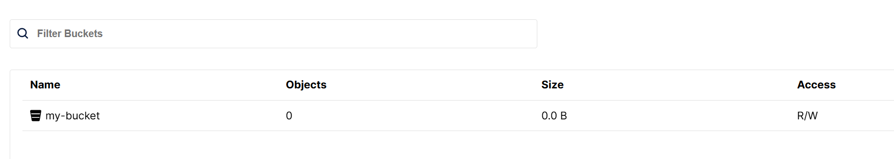
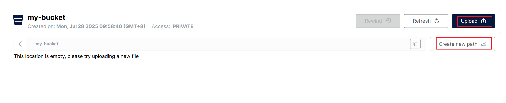
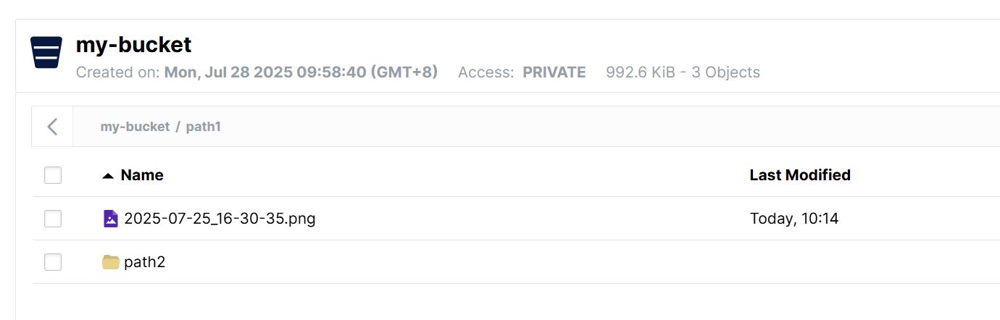

在侧边栏点击`Administrator`栏中的`Buckets`，这是`MinIO`的桶管理：

可以看到目前`MinIO`中没有任何桶，我们点击`Create Bucket`进行创建：

在创建页面，我们自定义`Bucket`的名称，并选择它的特性：

各特性选项的概念说明如下：

- `Versioning`表示版本控制，允许在同一个键下保存同一对象的多个版本。
- `Object Locking`表示对象锁定，用于防止对象被删除。它是实现保留（`Retention`）和法律保留（`Legal Hold`）的前提条件，且只能在创建`bucket`时启用。
- `Quota`表示配额，用于限制单个`bucket`中的数据总量。
- `Retention`表示保留策略，可设置规则，在指定时间内禁止对象被删除。启用保留策略前，必须先开启版本控制。

这里我们先什么选项都不选，创建后列表中就会展示出该`Bucket`：

点进该`Bucket`，可以看到里面还有很多配置信息，我们暂且不做讲解：

接下来我们点进`User`里的`Object Browser`：

可以在列表中看到我们创建的`Bucket`：

点击进该`Bucket`，可以创建路径，并上传文件或目录：

在指定路径下上传多个文件后，即可像操作系统中的文件结构一样进行查看和操作：

上传后的文件名与原始文件名保持一致。目前支持的操作包括上传、删除、下载和预览，但不支持重命名，因为对象的`Key`一旦创建便不可更改。若需实现重命名，可通过`mc`命令行工具、`SDK`或`API`执行“复制+删除”的方式间接实现。