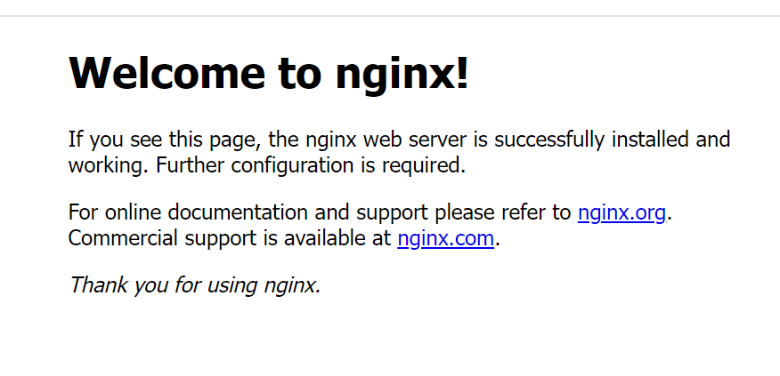

首先我们拉取Nginx的docker镜像下来：

```bash
docker pull nginx
```

递归创建需要挂载的目录（必须做，很重要）：

```bash
mkdir -p /home/docker/nginx/conf /home/docker/nginx/log /home/docker/nginx/html
```

这里我们把所有涉及到docker数据卷挂载的目录都放到`/home/docker`下面。

先创建一个Nginx容器：

```
docker run -d -p 80:80 --name nginx nginx
```

复制容器的一些文件或目录到宿主机
```sh
docker cp nginx:/etc/nginx/nginx.conf /home/docker/nginx/conf
docker cp nginx:/etc/nginx/conf.d /home/docker/nginx/conf
docker cp nginx:/usr/share/nginx/html /home/docker/nginx
```

其中`nginx.conf`为文件，`conf.d`和`html`为目录。

停止并删除原容器，开启新的nginx容器：

```bash
docker run -d \
-p 80:80 \
--name nginx \
-v /home/docker/nginx/conf/nginx.conf:/etc/nginx/nginx.conf \
-v /home/docker/nginx/conf/conf.d:/etc/nginx/conf.d \
-v /home/docker/nginx/log:/var/log/nginx \
-v /home/docker/nginx/html:/usr/share/nginx/html \
--restart always \
nginx
```

访问宿主机IP（默认端口即为80），出现如下页面：



表示安装成功。
