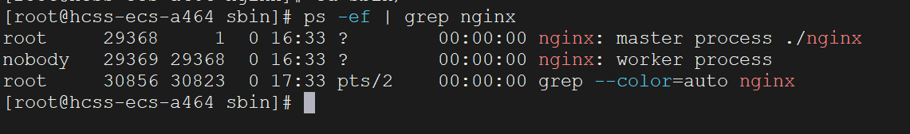
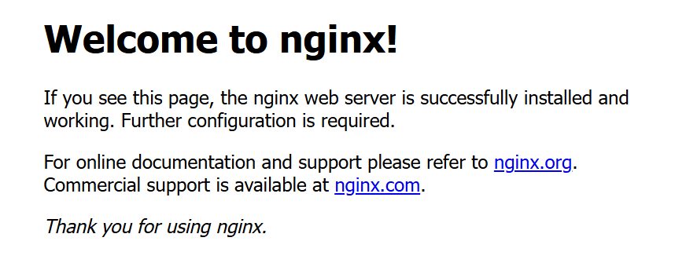

在`CentOS`服务器上安装`Nginx`服务时，首先使用下面的命令下载`Nginx`的压缩包：

```sh
wget https://nginx.org/download/nginx-1.28.0.tar.gz
```

这里我们下载`1.28.0`版本，具体版本可以根据实际情况进行调整。

`Nginx`的安装依赖`Linux`的若干库，我们使用下面命令对它们进行安装：

```sh
yum install gcc -y
yum install openssl openssl-devel -y
yum install pcre pcre-devel -y
yum install zlib zlib-devel -y
```

如果已经安装过了，`Linux`会提示`Nothing to do`，忽略该信息即可。

接着我们解压`Nginx`的压缩包到`/usr/local`目录中：

```sh
tar -zxvf /opt/software/nginx-1.28.0.tar.gz -C /usr/local
```

切换到解压出来的目录中：

```sh
cd /usr/local/nginx-1.28.0
```

在此目录下执行下面命令：

```sh
./configure --prefix=/usr/local/nginx
```

执行下面命令，进行编译与安装步骤：

```sh
make
make install
```

完成上述步骤后，可以看到在`usr/local`目录下生成了名为`nginx`的目录。切换到该目录下的`sbin`子目录中，执行以下命令：

```sh
./nginx
```

我们也可以通过配置文件来启动`Nginx`服务，命令如下：

```sh
./nginx -c /usr/local/nginx/conf/nginx.conf
```

需要注意，指定配置文件时，必须使用绝对路径。

使用下面命令检查`Nginx`服务是否已成功启动：

```sh
ps -ef | grep nginx
```

查询到如下结果，代表已成功启动：



`nginx`的默认端口号为`80`，因此可以通过浏览器直接访问服务器的`80`端口来打开`nginx`。由于`80`端口是默认的`HTTP`端口，也可以省略端口号直接访问。当浏览器显示如下界面时，说明`nginx`已成功启动：



如果想停止`Nginx`服务，杀掉上面查询出的`Nginx`进程即可。
