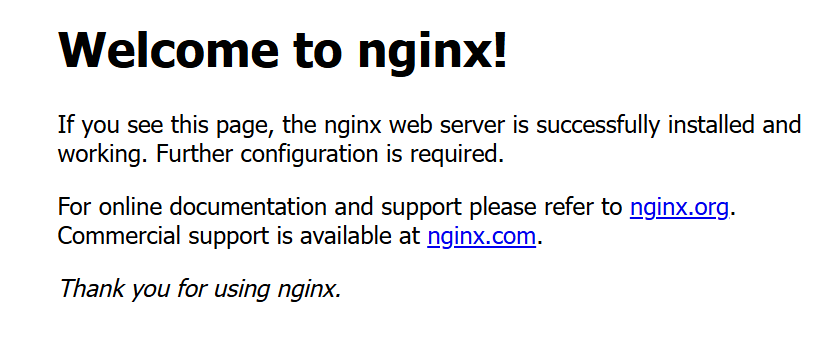

首先我们拉取`Nginx`的`Docker`镜像：

```sh
docker pull nginx:1.28.0
```

在`Linux`上创建以下目录，作为宿主机挂载目录：

```sh
mkdir -p /srv/docker/nginx/{conf,conf.d,html,logs,ssl}
```

`conf`目录用来存放`nginx.conf`等核心配置文件，`conf.d`目录用于存放`Nginx`的子配置文件，`html`目录用来存放`HTML`静态资源文件，`logs`目录用来存放`Nginx`访问日志和错误日志，`ssl`目录用于存放`SSL`证书文件。

接下来，我们先创建一个`Nginx`容器，用于拷贝相关的文件到宿主机：

```sh
docker run --name nginx -d -p 80:80 nginx:1.28.0
```

接着我们拷贝相关的`Nginx`文件：

```sh
docker cp nginx:/etc/nginx/nginx.conf /srv/docker/nginx/conf/
docker cp nginx:/etc/nginx/conf.d /srv/docker/nginx
docker cp nginx:/usr/share/nginx/html /srv/docker/nginx
```

强制删除前面创建的容器：

```sh
docker rm -f nginx
```

使用下面命令，再次创建`Nginx`容器，完成数据卷的挂载：

```sh
docker run \
    --name nginx \
    -p 80:80 \
    -p 443:443 \
    -v /srv/docker/nginx/html:/usr/share/nginx/html \
    -v /srv/docker/nginx/conf/nginx.conf:/etc/nginx/nginx.conf \
    -v /srv/docker/nginx/conf.d:/etc/nginx/conf.d \
    -v /srv/docker/nginx/logs:/var/log/nginx \
    -v /srv/docker/nginx/ssl:/etc/nginx/ssl \
    -d --restart=always \
    nginx:1.28.0
```

`nginx`的默认端口号为`80`，因此可以通过浏览器直接访问服务器的`80`端口来打开`nginx`。由于`80`端口是默认的`HTTP`端口，也可以省略端口号直接访问。当浏览器显示如下界面时，说明`nginx`已成功启动：



想停止对应的`Nginx`服务，只需停止并移除对应的`Nginx`容器即可：

```sh
docker stop nginx
docker rm nginx
```

