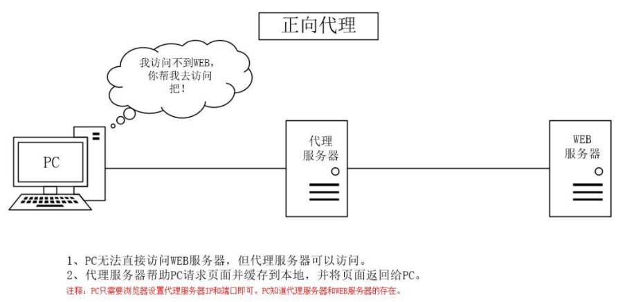
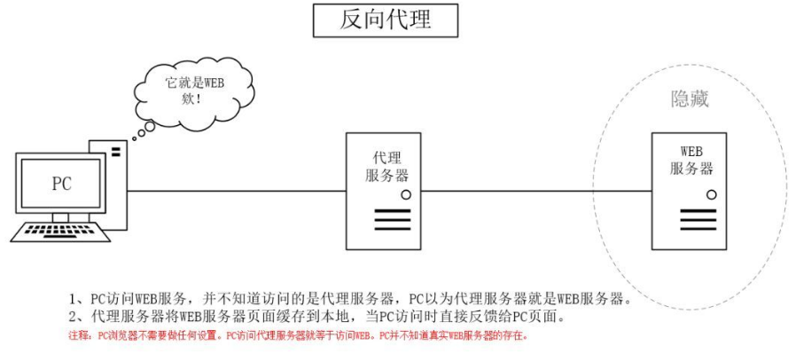

Nginx（engine x）是一款高性能的开源web服务器，也可以用作反向代理服务器、负载均衡器和HTTP缓存。

首先我们了解下正向代理：

正向代理是代理服务器位于客户端和目标服务器之间，代理服务器代表客户端向目标服务器发起请求。常见于客户端无法直接访问目标服务器的情况，例如访问外部互联网、绕过防火墙、隐藏客户端真实IP等。

例如科学上网，用户想访问一些外网网站，但是国内无法直接访问。这时候就使用到一个可以访问到外网网站的代理服务器，把用户的访问转发到这个外网网站，并返回该请求的响应。

这种代理方式，代理服务器对于真正的Web服务器不可见，服务端不知道真正的客户端是谁。

然后再了解下反向代理：

反向代理是代理服务器位于目标服务器和客户端之间，代理服务器代表目标服务器向客户端提供服务。常见于负载均衡、安全性、隐藏真实服务器IP等方面。

例如当你访问一个网站时，反向代理服务器接收你的请求并将请求转发到实际的服务器，然后将服务器的响应返回给你。客户端并不直接与真实服务器通信。

这种代理方式，代理服务器对于客户端不可见，客户端不知道真正的服务端是谁。

在反向代理中，真实的WEB服务器一般不止一个，代理服务器通过一些负载均衡策略，可以把请求分发到不同的服务器，防止单个服务器访问量过载的情况。