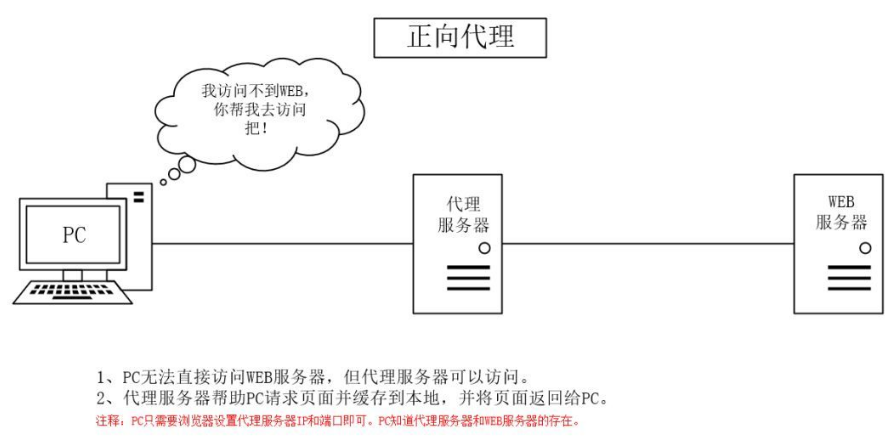

`Nginx`（`engine x`）是一款高性能的开源`web`服务器，兼具反向代理服务器、负载均衡器和`HTTP`缓存功能。

### 1. 正向代理

正向代理是一种代理服务器为客户端服务的架构，代理服务器代表客户端，向目标服务器发起请求。

这种代理方式通常出现在以下场景中：

- 客户端无法直接访问目标服务器（例如无法访问外部互联网）。
- 绕过防火墙或其他访问限制。
- 隐藏客户端的真实`IP`地址。

例如，用户在进行科学上网时，希望访问无法直接访问的外部网站。此时，用户可以通过一个可以访问外网的代理服务器，将请求转发给目标网站，并将响应返回给用户。这样，代理服务器对目标`Web`服务器是不可见的，目标服务器无法识别实际的客户端。

正向代理的示意图如下所示：

### 2. 反向代理

反向代理是一种代理服务器为目标服务器服务的架构，代理服务器代表目标服务器向客户端提供服务。

这种代理方式常见的用途包括：

- 负载均衡：将请求分发到不同的服务器，优化资源利用。
- 提升安全性：隐藏真实服务器的`IP`地址，减少攻击风险。

在访问网站时，反向代理服务器会接收客户端的请求，转发给实际的服务器，并将响应返回给客户端。客户端与真实服务器之间没有直接的通信，所有交互都通过反向代理进行。

反向代理的示意图如下所示：

在反向代理中，通常会有多个真实的`Web`服务器。代理服务器通过负载均衡策略将请求分发到不同的服务器，以避免单一服务器的过载，并提高系统的可用性和扩展性。