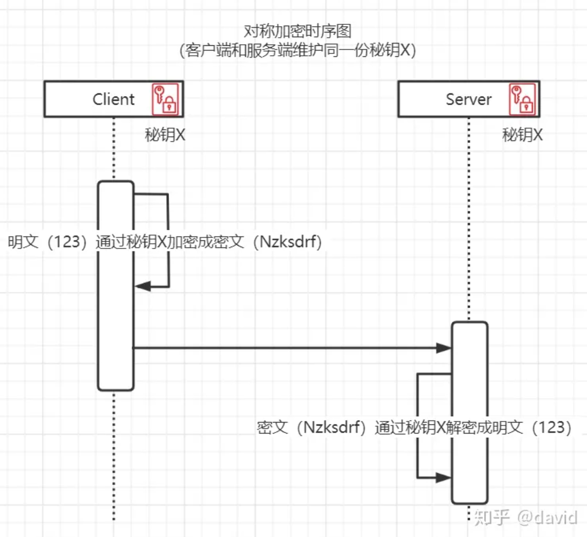
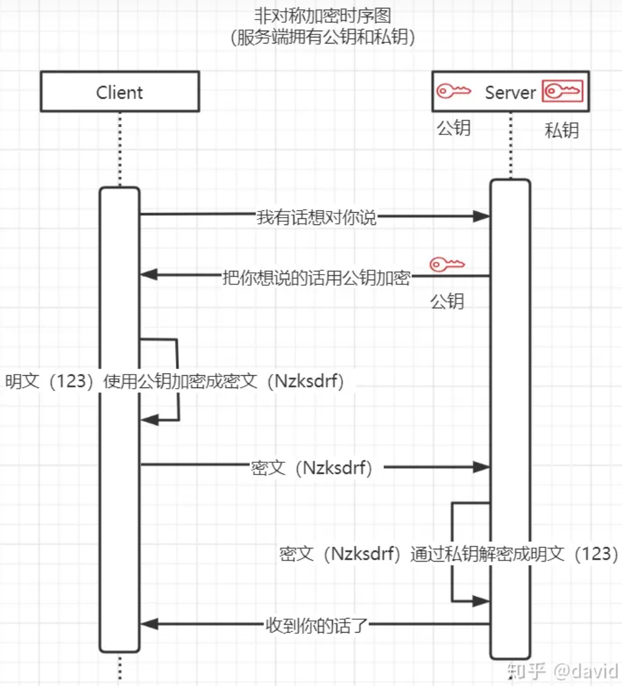

加入了一个新的项目组，是做网络设备采控的，他说领导想要提升我们自己团队的自研能力，采控插件需要go技术开发，所以邀请我去做技术。那边的技术人员说我需要了解各种网络协议：ssh、snmp、telnet、icmp等等。

这里我们讲一下SSH协议。SSH（Secure Shell Protocol，安全外壳协议）

SSH协议是运行在**应用层**（Application Layer）的协议。它提供了安全的远程登录和执行命令的机制，以及安全的数据通信传输。在TCP/IP模型中，应用层是最高层，负责处理网络服务和用户应用的网络访问。SSH使用**TCP协议**作为传输层协议，以确保可靠的数据传输和连接。

假设你是一名工程师，而公司的远程服务器是你的工作站，SSH就像你通过一扇安全的传送门，直接进入工作站。你可以查看文件、修改配置、运行程序等，就像你在服务器前亲自操作一样，但实际上你是远程操作的。

### 对称加密与非对称加密

密码学中有对称加密和非对称加密的两个概念，对称加密就是指加密和解密是同一个秘钥，这就要求客户端和服务端都需要有这个秘钥。它的优点是加解密效率高，速度快，缺点是对于服务端来说，每个想给这个服务端传递信息的客户端都需要有这个秘钥，使得管理变得困难，也容易出现秘钥泄漏的风险。



非对称加密就是指需要一对秘钥来进行加密和解密，公开的秘钥叫公钥，私有的秘钥叫私钥，公钥用来加密数据，私钥用来生成签名，公钥加密的信息只有私钥才能解开（解密数据），私钥加密的信息只有公钥才能解开（验证签名）。非对称加密的优点是安全性较高，且秘钥管理较为方便，每个服务器只需维护一对公私钥即可，缺点是加密耗时长，流程慢，效率较低。



### 端口转发

本地端口转发和远程端口转发是SSH协议的两种端口转发方式，用于在安全连接下将网络流量导向到其他主机服务器或端口。它们的区别如下：

**本地端口转发**是将本地服务器（操作命令的服务器）上的一个端口的流量转发到远程服务器上另一个端口。

例如本地8080端口有一个服务，而你希望通过SSH连接把它转发到远程服务器的9090端口：

```bash
ssh -L 9090:localhost:8080 user@remote-server
```

这样，当远程服务器访问9090端口时，实际上访问的是本地服务器的8080端口。

而**远程端口转发**就是将远程服务器上的一个端口的流量转发到本地服务器的另一个端口。

假设远程服务器上有一个服务在3306端口运行，你希望把它转发到本地的3306端口：

```bash
ssh -R 3306:localhost:3306 user@remote-server
```

这样，当本地服务器访问3306端口时，实际上访问的是远程服务器的3306端口。

