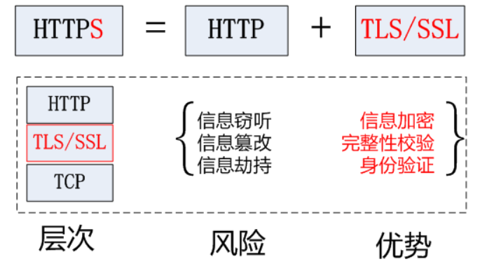

为什么HTTP是不安全的协议？

因为HTTP是以明文形式传递信息的，且HTTP无法验证通信双方身份，导致可能出现信息截取或中间人攻击。

HTTPS = HTTP + TLS/SSL

HTTPS就是HTTP协议在安全套接层上的加密版本，确保通信的机密性和完整性。

SSL协议建立在传输层（TCP）和应用层（HTTP）之间，分为SSL握手协议和SSL记录协议。

1. SSL握手协议：通过服务器向客户端传递数字证书，完成加密算法和密钥的协商，以建立安全连接。
2. SSL记录协议：负责对应用层的数据进行分片、加密和完整性校验，保障数据的安全性和完整性。

**HTTP与HTTPS比较:**

| 特征         | HTTP                     | HTTPS                               |
| ------------ | ------------------------ | ----------------------------------- |
| **安全性**   | 数据以明文传输，不安全。 | 数据经过加密，提供安全连接。        |
| **协议**     | 超文本传输协议。         | 安全超文本传输协议。                |
| **默认端口** | 80                       | 443                                 |
| **连接方式** | 非安全，无加密。         | 安全，使用SSL/TLS进行加密。         |
| **证书**     | 不需要证书。             | 需要SSL证书进行服务器身份验证。     |
| **性能**     | 通常更快。               | 可能引入额外的计算和通信开销。      |
| **成本**     | 协议本身无费用。         | 需要获取和维护SSL证书，可能有费用。 |
| **配置**     | 配置相对简单。           | 配置更为复杂，涉及证书管理。        |
| **缓存**     | 通常更易实现缓存。       | HTTPS缓存可能更为复杂。             |

**HTTPS的缺点:**

| 缺点             | 描述                                                  |
| ---------------- | ----------------------------------------------------- |
| **性能开销**     | HTTPS可能引入额外的计算和通信开销。                   |
| **成本**         | 获取和维护SSL证书可能产生费用。                       |
| **配置复杂性**   | 配置和维护HTTPS需要更多工作，包括证书管理等。         |
| **缓存问题**     | HTTPS对一些Web优化技术如CDN和缓存的支持不如HTTP友好。 |
| **不是绝对安全** | 虽然提供高安全性，但不能绝对防范所有攻击。            |
